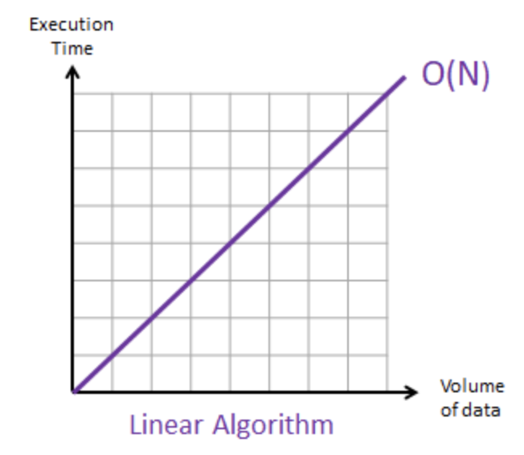
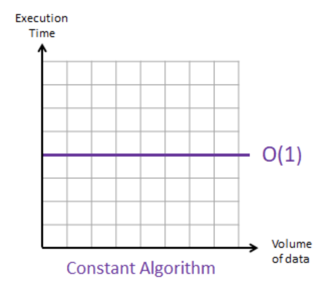
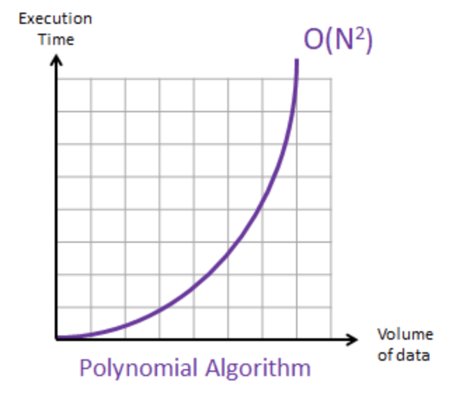
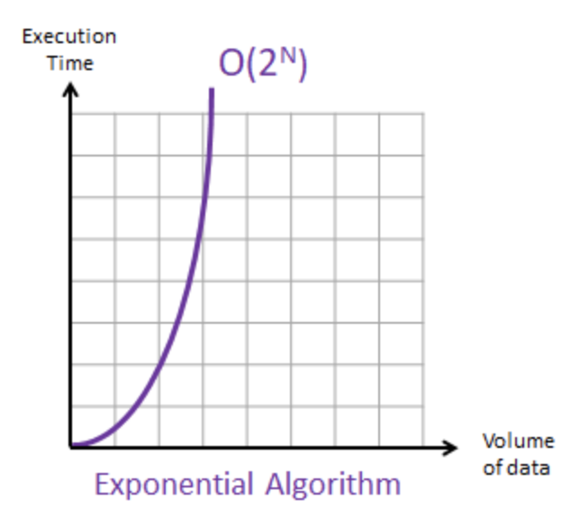
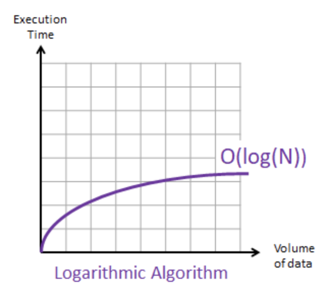

# Algorithms

### Learning Objectives

- Know what an algorithm is
- Understand Binary search and Linear Search
- Understand how we can measure the effectiveness of an algorithm

## Intro

Do you know what an algorithm is? You might think that you don't. You might imagine
that it's something complicated or difficult. You might have heard phrases like
"bubble sort" or "binary search" and just tuned out.

But really it's super simple: **an algorithm is a strategy for solving a problem.**

It's really just that.

Examples of problems we might use algorithms for are:

- searching for something
- sorting a collection of things
- finding prime numbers
- calculating whether a projectile hits an enemy in a video game

There are often many different algorithms which we can use to solve the same problem.

In these cases, we need a way to compare the effectiveness of given algorithms.

Today we will look at some common algorithms, and at how we can compare them.

## Searching


### Linear Search: searching an array.

Let's say we want to search the following ArrayList for a given number:

```java
[ 1, 3, 7, 8, 9, 21, 23, 45, 56 ];
```

#### Linear Search

We could write some code to do that, using a "Linear Search". Don't let the name
put you off - you've probably written one of these before.

> Open start point.

You will see that we have 4 tests set up in `SearchTest` class.

Uncomment the 2 linear search tests.

To get these tests passing we will write our linear search method in the `Search` class.

In a linear search we loop through the collection and compare each entry in turn. If the entry matches our search term we will return true. If the loop manages to complete we will return false.

```java
//Search.java

public class Search {

  public Boolean linearSearch(ArrayList<Integer> array, int search_number) {
    for (int number : array)
    if (number == search_number){
      return true;
    }
    return false;
  }
}
```

> https://en.wikipedia.org/wiki/Linear_search

Some things to think about regarding **searching through every item one at a time**:

* How fast is this if the item we're looking for is the first?
* How fast is it if our item is last?
* How fast is it if our item is the very last AND there are a million items in the array.

Finally - **how much of an impact does the size of the data set have on the speed of the algorithm**

( we can't actually answer these questions directly - yet - but it's good to think about just now)

So, we might ask, quite sensibly, if we can find a faster approached to this problem.


#### Binary Search

Linear search means we look at one element at a time, but there may be a **divide and conquer** approach that lets us break it down.


Of course, it turns out we can. And we do it like this:

- Pick the middle item in the array.
- If it's our number, then we're done. Otherwise, check if our number is bigger or smaller than it.
- If it's bigger(/smaller), repeat the process with the second(/first) half of the array

In programming this is how a binary search works. (Note that this only works on sorted arrays)

To do this in Java is really complicated but let's have a look...

```java

// Search.java

public static Boolean binarySearch(ArrayList<Integer> array, int searchNumber){
  if (array.size() == 0){
    return false;
  }

  int midIndex = 0;
  if (array.size() >1) {
    midIndex = (int) Math.ceil((double) array.size() / 2);
  }

  int midPoint = array.get(midIndex);

  if (searchNumber == midPoint){
    return true;
  }

  ArrayList<Integer> newSearchArea;

  if (searchNumber < midPoint){
    newSearchArea = new ArrayList<Integer>(array.subList(0, midIndex));
  } else {
    newSearchArea = new ArrayList<Integer>(array.subList(midIndex + 1, array.size()));
  }
  return binarySearch(newSearchArea, searchNumber);
}

```

### Recursion

Recursion is when a method/function calls its self. If a series of actions needs to be performed again from within a method, it's ok to call that again. However, we need to be extremely careful that eventually we stop recursing.

### Infinite Recursion
If we had no condition where the method calls its self but doesn't ever stop, then we will infinitely recurse. This is very bad, as eventually the computer (or in our case the JVM) will run out of a type of memory called **stack** and the program will crash.

## Time Complexity

We don't want to measure algorthms performance with actual time, but time is a factor. If we actually time how long an algorithm takes to run, then it will vary from computer to computer.

We measure algorithms with "Time Complexity".

That is: how long it will need to run before we can guarantee a correct result.


## Types of algorithm

**We measure the performance of an algorithm** by first figuring out what cateogry it goes into. But to do that, we need to measure it's complexity against the input data.


### Linear
When an algorithms performance grows linearly and in direct proportion to the input data set, then we describe that that as **linear complexity**.



For every element we put in, it takes a certain amount of time (or number of computer cycles or operations) to complete

#### Linear Example in Code
Any situation where we have a 1-dimensional array or input set, and we're looping or iterating over **every element** then it's described as linear complexity.

```java

for (int i = 0; i < myArray.size; i++){
	// do something
}
```

### Constant

When the input size doesn't have **any effect** on the time performance of the algorithm, then we describe that operation as being **constant complexity**.




```
myArray[3] = 5;
```

We can look through some code and identify what's constant. Most operations are constant.

### Square

When the performance of an algorithm is directly proportional to the square (`x^2`) of its input, then we call this **square complexity**.



```java

for (int i = 0; i < myArray.size; i++){
	for (int j = 0; j < something; j++){
	   // do something
	}
}
```

### Exponential

When each addition to the input set slows down and degrades the performance.

**As the algorithm processes it actually slows down.**



```java

int fibonacci(int number)
{
    if (number <= 1) return number;

    return fibonacci(number - 2) + fibonacci(number - 1);

}
```

Exponential algorithms are often **doubly recursive**. We call `fibonacci` twice recursively each time.

### Logarithmic
When the data being processed decreases (for example by halves each iteration) then the complexity is described as logarithmic.



An example of logarithmic is our binarySearch method.

```
- Pick the middle item in the array.
- If it's our number, then we're done. Otherwise, check if our number is bigger or smaller than it.
- If it's bigger(/smaller), repeat the process with the second(/first) half of the array
```

Logarithmic algorithms are sometimes **recursive**.


## Big O Notation

Big O is a notation that's used to describe the types of algorithms we just listed. For the most part, the mathematics behind **BigO** hard to understand without proofs, so we don't try to understand it.

It's important to try and remember the bigO's, though, because they are widely reffered to by their bigo notation.


* **Linear** is described as **`O(n)`**
* **Constant** is described as **`O(1)`**
* **Square** is described as **`O(n^2)`**
* **Exponential** is described as **`O(2^n)`**
* **Logarithmic** is described as **`O(log n)`**

## Analysing our search algorithms

Let's analyse the linear search.
*Best case*: `O(1)` since our number will be first
*Worst case*: `O(n)` as we'll have to traverse the whole array
*Average case*: `O(n)`

Let's analyse the performance of binary search now.
*Best case*: `O(1)` - this is pretty simple. Sometimes, when we're very lucky, the number we want will be the midpoint.
*Worst case*: `O(log(n))`
*Average case*: `O(log(n))`

## Algorithmic Optimisation

As we've seen, we can have many methods for solving a problem, each with their
own algorithmic complexity. A big problem in computing is the concept of
algorithmic optimisation.

What we mean by that is trying to improve an algorithm so that it's time complexity is slower-growing. For example we might start with
a `O(n)` algorithm and try to improve it to get to a `O(log(n))` one.

We do this in everyday life, too! When cutting carrots it's simpler to cut it
into sticks and then slice several sticks at a time into little chunks. Equally,
when we're debugging our code we often try to find out what method an error is in
and then check each line in there, rather than searching line-by-line through the
whole program.


### Sorting

There are a number of algorithms available to use shown below.

* Bubble sort
* Cocktail-Shaker sort
* Quick sort
* Odd-even sort
* Merge sort
* Insertion sort
* Bucket sort
* Interpolation search
* Jump search
* Fibonacci search

This web page gives good examples of sorting algorithms:

[Sorting Algorithms](https://visualgo.net/bn/sorting?slide=1)


There are also a number of resources available to research the different algorithms:

[Sorting Algorithms](https://www.toptal.com/developers/sorting-algorithms)

[Linear Search](https://www.tutorialspoint.com/data_structures_algorithms/linear_search_algorithm.htm)

[Binary Search](https://www.tutorialspoint.com/data_structures_algorithms/binary_search_algorithm.htm)
