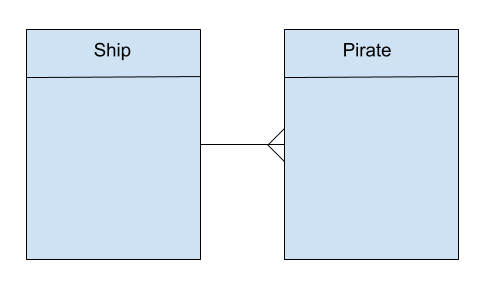
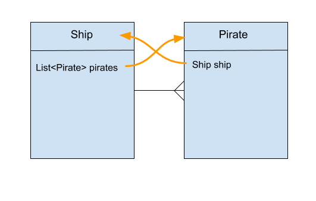
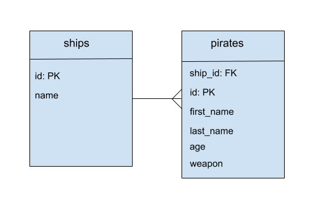

# One-To-Many Relationships using annotations

## Learning Objectives

- Understand the one-to-many relationship.
- Know how to map one-to-many relationships using hibernate annotations.

## Introduction

**Why are we learning this?** In Object Orientated programming it's extremely common to have objects that contain lists of other objects, or are related in some other way.

When saving these objects to the database, we want to save them in such a way that when the data is queried, the relationships are preserved, or that the relationships between objects actually help us query the data. For example:

- Give me all of the students for instructor Barbara
- Give me the students Barbara has who've done the weekend homework

Forgetting about databases for a moment, the above examples couldn't work if there was no relationship between the classes that represent the student and instructor objects.

We need to allow relationships to be saved to the database. There are three types of relationship:

- One-to-Many
- Many-to-Many
- One-to-One

This lesson will only focus on One-to-Many.

## Making sure the database is clean and ready to use

Open Postico go to the database pirates (If it exists).
If it does exist then right click on it and say delete to remove it so that you are starting from a fresh start point.
Open a terminal and type in ```createdb pirates``` to create a fresh Database.
Note that this is only needed for the purposes of lessons ordinarily you would use the same Database and not delete it every time.

## Understanding the relationships

Extending on our pirate system, we now want to create a `Ship` class that will be persisted with a `ships` table that has the following properties:

* name - the name of the ship
* pirates - a `List` of `Pirate`

A ship will have a name and `List` of `Pirate`. To do this without databases entirely, that's all we would need. However to save that relationship in the database we need to do a little more. We need to know:

- the relationship between `Ship` and `Pirate` is **one-to-many**, that one `Ship` has many `Pirate`'s.
- the backwards relationship is **many-to-one**, that many `Pirate`s has one `Ship`.



**One ship has many pirates**

### Why map the opposite relationship?

With JPA + Hibernate, which we are going to use, this opposite relationship must also be realised and then mapped because queries from both sides need to work. For example, if we have a `Pirate` object and want to know its associated `Ship`, that ship (or at least the ships ID) needs to be stored in `Pirate`.

In simple terms, a ship will have a list of `Pirate`s and a `Pirate` will have a single `Ship`. This single `Ship` in `Pirate` simply "points back" to the `Ship`.

The following diagram shows very simple UML with the Ship containing a `List` of `Pirate` and the `Pirate` containing one `Ship` with the relationships annotated in orange.



## Database Tables

Let's talk "database", putting the Java to one side for a moment. We know two tables are required: One called `ships` and one `pirates`. Remember it's a convention that table names use the plural.

### Foreign Keys

Relationships between tables in databases are made with **foreign keys**. A foreign key is a column in a table that contains the primary key of another table. Thus, the foreign key points to the primary key in another table, pointing to that table.



*Database Tables*

## Setting up the Relationships for JPA + Hibernate

We now completely understand the relationship we want to create in Java code, and have some understanding of what the resulting table structure needs to be. A quick summary so far will help with the next steps.

- One ship should have many pirates
  - `Ship` should contain an ArrayList of `Pirate`s
  - This is the **one-to-many** relationship
- Many pirates should have one ship
  - `Pirate` should have a single associated `Ship` to "point back"
  - This is the **many-to-one** relationship
  - The `pirates` table has a foreign key `ship_id` pointing to the associated ship.

## Annotations

By using the above list as a guide, we now have enough information to correctly annotate the `Pirate` and `Ship` classes.

### One `Ship` should have many `Pirate`s

An annotation for this is provided by JPA `@OneToMany`. It should be used to annotate a `Collection`, `List` or `ArrayList` property. In our case, we use it to annotate the `List` of `Pirate` in the `Ship` class. Like all Hibernate + JPA annotations, it can be either put directly on that property or the getter.

`@OneToMany` takes an argument `mappedBy` which needs to have the name of the property in `Pirate` class that we wish to use as the foreign key.

We will also use the fetch type `LAZY`. This means that when a ship is loaded from the database then the associated pirates should only be loaded on demand, or when it's asked for. The alternative here is that when a ship is loaded, it loads all the pirates too, this is called EAGER `FetchType`. We may not want **all** the pirates when loading a ship, so for now we use `FetchType.LAZY`. Looking into `Ship.java` we can see the list of `Pirate` annotated with `@OneToMany`.

```java
@OneToMany(mappedBy="ship")
private List<Pirate> pirates;
```
#### 'new' the List in constructor

When an instance of `Ship` is being created, the `List` of `Pirate` must also be instansiated, otherwise we will get a `null pointer exception`. This is when an object is being used that hasn't been instansiated or *"new'd"*.

Remember to `new` the list in the constructor of `Ship`

```java
this.pirates = new ArrayList<Pirate>();
```


#### Many `Pirate`s should have one `Ship`

An annotation for this is provided by JPA called `@ManyToOne`. It should be used to annotate the property in our class that **points back** to the class that stores many of it.

In our case we use it to annotate the `ship` property in `Pirate`. Since a `Pirate` needs to point back to its `Ship`. Also, because we need to tell JPA that we know `pirates` table needs to have a foreign key for `ships`.

```java
// ...

@ManyToOne // NEW
@JoinColumn(name="ship_id", nullable=false) // NEW
private Ship ship; // NEW
```

The `@ManyToOne` annotation is used to set the relationship between `Pirate` and `Ship` classes.

The `@JoinColumn` annotation will generate a column `ship_id` (a foreign key) in the pirates table which will point to the id of the `ships` table (primary key). JPA + Hibernate will take care of this for us. We only need to worry about the Java side which is why we don't give the `Pirate` class a `ship_id` property.

To ensure that each pirate needs to have a ship we will set the foreign key as `nullable = false`. So there must be an entry in that column. If we tried to save a pirate to the database without assigning them a ship then we would get a null pointer exception, for exmaple, `not-null property references a null or transient value : models.Pirate.ship`. We would also get an error if we save a pirate with a ship before we save the ship to the database as there would be no matching ship id.

So to ensure Pirate must have a ship we will also change the constructor of Pirate to take in the ship when we create a new Pirate object.

```java
// ...

@ManyToOne
@JoinColumn(name="ship_id", nullable=false)
private Ship ship;

public Pirate(String firstName, String lastName, int age, Ship ship) { // MODIFIED
  this.firstName = firstName;
  this.lastName = lastName;
  this.age = age;
  this.ship = ship; // NEW
}
```

### Set ship getter + setter


We've just added a new property `ship` to the `Pirate` class so it's important to not forget to add a getter and setter for that property.

```java
public Ship getShip() {
    return ship;
}

public void setShip(Ship ship) {
    this.ship = ship;
}
```

### Ship JpaRepository

In exactly the same way we done with `PirateRepository` we should create an interface `ShipRepository` that implements `JpaRepository`

```java

public interface ShipRepository extends JpaRepository<Ship, Long> {
}

```

### Creating Pirates and Ships

One we've updated `Pirate` and `Ship` it's now possible to setup both to save some data to the database.

We will need to inject the ship repository as well.

```java

public class PirateserviceD1StarterApplicationTests {

  @Autowired
  PirateRepository pirateRepository;

  @Autowired
  ShipRepository shipRepository;

  // AS BEFORE

  @Test
  public void createPirateAndShip(){
    Ship ship = new Ship("The Flying Dutchman");
    shipRepository.save(ship);

    Pirate pirate1 = new Pirate("Jack", "Sparrow", 32, ship);
    pirateRepository.save(pirate1);
  }
}
```
###NOTE:
Each time you run the test it will add a new pirate to the database as the database is set to update mode in the application.properties file.


*SQL Console Output*


## Checking the controller
Looking back at the `PirateController` we still have endpoint setup to get all pirates on `/pirates`.

Trying this endpoint now will result in some odd and likely non-deterministic behavior. Non-deterministic means it won't give a consistent results each time. In computing, non-determinisim is often bad, as inconsistency proves shows things are not working correctly.

To investigate this, look at the log output from Spring. We might see some errors like:

```
Cannot render error page for request [/pirates] and exception [Could not write JSON: Infinite recursion (StackOverflowError);
```

This means that for some reason, when the JSON is being created from our object, it's infinitely recursing because of some property.

Thinking about the relationship between `Pirate` and `Ship`. A `Ship` has a list of `Pirate`, and `Pirate` has a single `Ship` it's "in".

The serializer, which converts our objects to JSON is attempting the following:

1. Look at a ship
2. Go through all its properties and try to serialize them
3. If a relationship property is found, go to that relationship. So it finds `pirates` and goes into that object.
4. Look at that pirate
5. Go through all its properties and try to serialize them
6. If a relationship property is found, to to that relationship. So it finds `ship` and goes to that object.
7. Look at that ship
* ..
* .
* And so on repeating this pattern

This will happen without any issue for a long time in computing terms, until Java runs out of memory. This explains the "StackOverflowError".

### Fixing the recursive JSON StackOverflow

We now know that the problem is caused by the serializer which converts our object to JSON trying to serialize the properties of our model which have relationships.

This can be stopped simply by adding an annotation to these properties `@JsonIgnoreProperties({"ship"})`. This tells the serializer to not try and convert these properties to JSON.


In `Ship` we now have:

```java

@JsonIgnoreProperties({"ship"})           	// NEW
@OneToMany(mappedBy = "ship")
private List<Pirate> pirates;
```

Now when we hit the `/pirates` route things look much better and we no longer see an error in the terminal. Our process now looks more like this:

1. The `pirates` are serialized as before
2. When we reach a pirate's ship, we serialize it as well
3. The serializer sees the annotation in `Ship`, which tells it that when it serializes that ship's `pirates` it should ignore their `ship` property
4. The remaining properties in `Pirate` do not need to be serialized further and so the process finishes

We can ignore multiple properties if we so wish by adding them as further arguments to the annotation. For example, if we also wanted to ignore a pirate's age we would write `@JsonIgnoreProperties({"ship", "age"})`. By using this annotation we avoid the infinite recursion, but we are still duplicating the `Pirate` information by nesting them inside the `Ship`. We will look at another annotation in a future lesson which will restrict the serialization even further.

# Summary

- Should have some understanding the one-to-many relationship.
- Should have some idea how to map one-to-many relationships using hibernate annotations.
