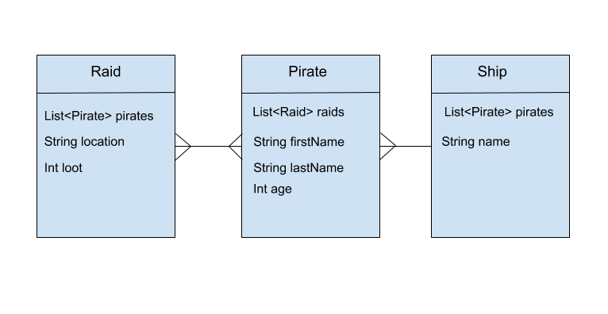

# Advanced Derived Queries with JPA

**Lesson Duration: 30 minutes**

## Learning Objectives
- Understand how to use derived queries to perform queries across multiple classes.

## Making sure the database is clean and ready to use

Open Postico go to the database pirates (If it exists).
If it does exist then right click on it and say delete to remove it so that you are starting from a fresh start point.
Open a terminal and type in ```createdb pirates``` to create a fresh Database.
Note that this is only needed for the purposes of lessons ordinarily you would use the same Database and not delete it every time.

NB: If you had to change the username by which you connect to the database in the previous lessons you will need to change it again in the application.properties under the main->resources folder.

## Intro
We've seen how to to basic derived queries - ones which perform queries on just one class. We're now going to see building derived queries across multiple classes.

## Building A Derived Query
Lets put together a query for getting all the `Pirate`s for a given `Raid`. [Jump to doing this](#build_query)


<a name="build_query"></a>
### Build the Derived Query

We can make things easier by saying **we want all the Pirates for a given Raid `id`**. This time, we're traversing multiple models to perform the query it's possible we just need to remember:

**To filter for an attribute of an associated entity, you can traverse managed relationships by referencing the attribute that maps the association followed by the attribute of the related entity.**

This is relative to where the query is taking place. We want to get back all the **Pirate** objects for a Raid, so we need to do the query in the `PirateRepository`.

In English, we can think about our query as:

*Find all Pirates for Raid id*

To traverse across to an associated model we need to use the `raids` property of the `Pirate`. We'll use that to access the `id` on the `Raid`.    So we will write `findByRaidsId`. We're 'in' doing this from the perspective of the `Pirate` model, so we need to "jump" to the Raid to get the raid id, and to do that we'll go via the `raids` property. 


```java
//PirateRepository.java

    List<Pirate> findByRaidsId(long id); // Added
    // 'Raids' is the property in pirates which links to raid.

```


Let's add a test for it, and check we get the only pirate on Raid with id `1`.

```java
	@Test
	public void findPiratesByRaidId(){
		List<Pirate> foundPirates = pirateRepository.findByRaidsId(1L);
		assertEquals(1, foundPirates.size());
		assertEquals("Jack", foundPirates.get(0).getFirstName());
	}

```

Generally we can use this pattern to figure out how to write the query.

**operation**By<**connectedProperty-****Property**><**operator**>[]

where:


*  **operation** is one of `find`, `read`, `count`, `get`.
*  **connectedProperty** is the related property we need to use to access the property. In our case above we used raids in Pirate to get to the raid id.
*  **object** is the type of object you expect back from the query. 
*  **property** is a property on the **object**
*  **operator** is one of `And`, `Or`.


### UML Diagram (for reference)



## Task (10 mins): Find all Ships with a given pirate's first name on them

* Write a query to find all the ships that have pirates with a given first name on them
* Write a test to make sure the query works.
* TIP: Think what repository it should be in. We want Ship(s) back so ShipRepository.java

<details>
<summary>
Solution
</summary>

```java
//ShipRepository.java
        List<Ship> findByPiratesFirstName(String firstName);

```

```java
//PirateserviceApplicationTests.java

@Test
	public void canFindShipsWithPiratesFirstName(){
		List<Ship> foundShips = shipRepository.findByPiratesFirstName("Maggie");

	}
	
```
</details>

## Task (10 mins): Find all the raids for a given ship

* Write a query to find all the raids for a given ship
* Write a test to make sure the query works.
* Tip: you'll need to give it a Ship you know has pirates that are on raids!

<details>
<summary>
Solution
</summary>

```java
//RaidRepository.java
       List<Raid> findByPiratesShip(Ship ship);
```

```java
//PirateserviceApplicationTests.java

	@Test
	public void canFindAllRaidsForAGivenShip(){
		Ship  foundShip = shipRepository.getOne(3L);
		List<Raid> foundRaids = raidRepository.findByPiratesShip(foundShip);
	}
	
```
</details>