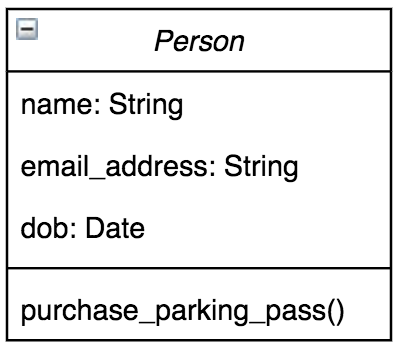

# Introduction to Class Diagrams

## Learning objectives

1. Know what class diagrams are used for in programming.
2. Understand how diagrams can help us
3. Be able to draw a class diagram

## Intro
So far we've been giving you specifications of things we'd like you to build. However often you'll be faced with a problem and have to figure out a possible solution to it yourself. It can be tempting to just dive in and start coding but this can waste time if you go down the wrong track without thinking things through.

This brings us to... planning! It's always good to plan out your work before you try to code it. This helps you to write well-organised, easy to understand code. We will have a longer lesson on planning near to your first projects, so for now we'll focus on one aspect of it - drawing diagrams.

Drawing a diagram lets us visualise the structure of our code from a high level. Doing this before we write any code can help us spot any potential problem areas, or let us think of several possible solutions and choose which one we think is best.

There are various pieces of software you can use to create diagrams, but for now we'll just use a pen/pencil and paper.

## Class Diagrams

Class diagrams can help us think about what components will make up our program. We can plan out what attributes and methods they might need, how many different classes might be necessary, and what relationships they should have with each other.

You may have heard of UML - Unified Modelling Language. This is a language intended to provide a standardised way of modelling software systems. They also have a standardised set of diagrams that can be used for modelling code in any language.

We're going to be using diagrams that are similar to UML ones, but we aren't too concerned about strictly following their formal rules. The first type of diagram we'll look at are class diagrams.

## Your First Class Diagram



A Person class has name (Person), a set of attributes (name, email_address, dob) and some behaviour calls methods (purchase_parking_pass())

Here's some code that uses our not-yet-implented Person class:

```python
sarah = Person("Sarah", "sarah@email.com", 'Jun 1 2005')
john = Person("John", "john@email.com", 'Feb 9 1980')

sarah.purchase_parking_pass()
john.purchase_parking_pass()
```

First we instatiate two Person objects with different attributes. Then we make use of the purchase_parking_pass method to have each Person purchase parking.

## Class Relationships

What if we have more than one class? Usually within a program, classes will relate to each other in some way. Here's how we represent those relationships in a diagram.


*Image courtesy of http://creately.com*

Useful link:
http://agilemodeling.com/artifacts/classDiagram.htm

Representing relationships between classes:
http://creately.com/blog/diagrams/class-diagram-relationships/

## TASK:

- Draw a class diagram for a Car class. 
