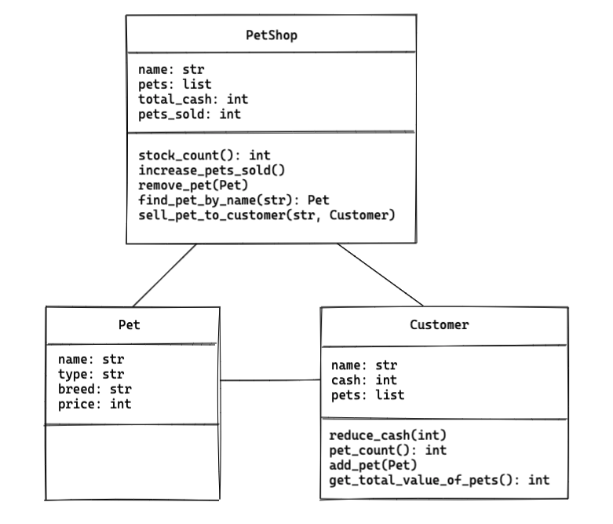
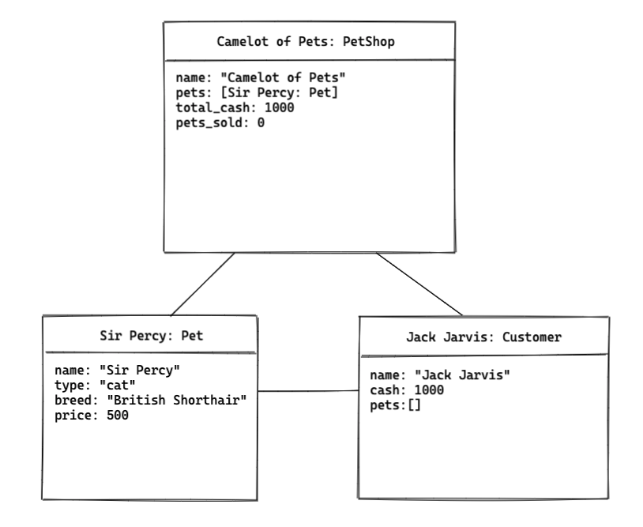

# Object Diagrams

## Learning objectives

1. Know what object diagrams are used for in programming
2. Understand the differences between class and object diagrams
3. Be able to draw an object diagram

## Intro - Class diagrams
We've seen how diagrams are useful for planning and visualling the structure of our code. Class diagrams show what properties/attributes and methods classes might need, how many different classes might be necessary, and what relationships they should have with each other. 

## Object diagrams

An object is a specific 'instance' of a class, so similarly an object diagram is an 'instance' of a class diagram. This is useful for showing a detailed snapshot of the state of our program, whether hypothetical or at an actual point in time.

Notice the differences from a class diagram:
- The title of each object includes an identifier value (e.g. `Camelot of Pets: PetShop`)
- Instead of types for each attribute, an example value is indicated (e.g. `total_cash: 1000`)
- No methods are included

