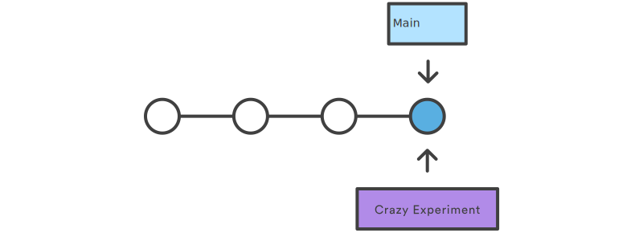

# Git Branching

#### Duration 30 mins

## Learning Objectives

- Be able to create a branch
- Be able to delete a branch
- Be able to merge a branch

## Introduction

Branching is a feature available in most modern version control systems.

Branching in other VCSs can be an expensive operation in both time and disk space. In Git, branches are a part of your everyday development process.

Git branches are effectively a pointer to a snapshot of your changes. When you want to add a new feature or fix a bug - no matter how big or how small - you spawn a new branch to encapsulate your changes.

This makes it harder for unstable code to get merged into the main code base, and it gives you the chance to clean up your future's history before merging it into the main branch.


The diagram above visualises a repository with two isolated lines of development, one for a little feature, and one for a longer-running feature. By developing them in branches, it's not only possible to work on both of them in parallel, but it also keeps the main <code>main</code> branch free from questionable code.

The implementation behind Git branches is much more lightweight than other version control system models. Instead of copying files from directory to directory, Git stores a branch as a reference to a commit. In this sense, a branch represents the tip of a series of commits - it's not a container for commits. The history for a branch is extrapolated through the commit relationships.

Git branches are an integral part of your everyday workflow. The following content will expand on the internal Git branching architecture.

## How It Works

 A branch represents an independent line of development. Branches serve as an abstraction for the edit/stage/commit process. You can think of them as a way to request a brand new working directory, staging area, and project history. New commits are recorded in the history for the current branch, which results in a fork in the history of the project.

 The `git branch` command lets you create, list, rename, and delete branches. It doesn't let you switch between branches or put a forked history back together again. For this reason, `git branch` is tightly integrated with the `git checkout` and `git merge` commands.

## Creating Branches

First, you can list all of the branches in your repository. This is synonymous with ```git branch --list```

```bash
git branch
```

It's important to understand that branches are just pointers to commits. When you create a branch, all Git needs to do is create a new pointer, it doesn't change the repository in any other way. If you start with a repository that looks like this:


Then, you create a branch and start working on it using the following command:

```bash
git checkout -b crazy-experiment
```

The repository history remains unchanged. All you get is a new pointer to the current commit:



Your terminal will indicate which branch you are working on. Once you're on the branch you can try out new code, do `git commits` and make mistakes while your `main` branch remains untouched.

Once you're finished and want to merge the branches together you can switch back to main and `merge` in the new code from `crazy-experiment`

```bash
# switch back to main
git checkout main

# make sure you have the latest version of main from the remote repo
git pull origin main

# merge in your experiment code
git merge crazy-experiment
```

## Creating Remote Branches

So far these examples have all demonstrated local branch operations. To push your new branch to your Github repo run the following command.

```bash
git push origin crazy-experiment
```

This command will push a copy of the local branch 'crazy-experiment' to the remote repo.

## Deleting Branches

 Once you’ve finished working on a branch and have merged it into the main code base, you’re free to delete the branch without losing any history:

```bash
git branch -d crazy-experiment
```

## Cheatsheet

```bash
# new branch
git checkout -b feature/crazy-experiment

# move back to main branch
git checkout main

# merge branch (while on main)
git merge feature/crazy-experiment

# delete branch
git branch -D feature/crazy-experiment
```

## Summary

We've discussed Git's branching behaviour and the 'git branch' command. The 'git branch' commands primary functions are to create, list, rename and delete branches.

Compared to other VCSs, Git's branch operations are inexpensive and frequently used. This flexibility enables powerful [Git workflow](https://www.atlassian.com/git/tutorials/comparing-workflows) customisation.
