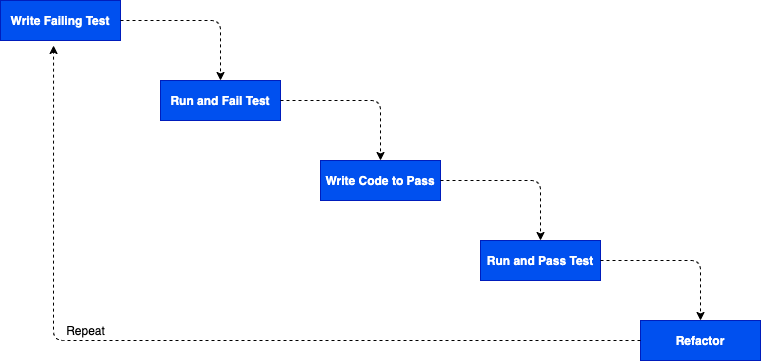

# Test Driven Development

### Learning Objectives

- Know what TDD is
- Understand the benefits of writing tests first
- Be able to use TDD to write well-tested code that works as expected

  
## What Does It Mean to "Test-Drive" Development?

TDD stands for Test-Driven Development.

At its simplest, it is just writing tests first, then writing the code to make them pass.

If we want to be a bit more precise about it, TDD lets us design our application and think about what functions we need to write, and what effect we want them to have, before we write them.

We do this by writing a test about the function we *wish* we had, even though we know it (probably) won't pass. So if I want a function that adds one to any
number, I'd start by pretending I already had that function, and write out how I wanted it to look. 


``` python
def test_add_one_5_is_6(self):
    expected_value = 6
    actual_value = add_one(5)
    self.assertEqual(expected_value, actual_value)

```

We are trying to design a function which -

- is well named
- takes in appropriate arguments
- has a sensible return value (if it needs to return something)
- returns what we expect given the argument(s) we provided 

At this point we don't think about _how_ our function is going to perform what we ask of it, even though it might be hard to resist the temptation. 

Once we're written our test we run it, take a small step to eliminate any error, and repeat until we get the test to pass. In our example above our first error would likely be -

```bash
NameError: name 'add_one' is not defined
```

And our small step would be to define the function

```python
def add_one():
    pass
```

Now we'd run the test again. Fix any error. And repeat until we have a passing test.


## Why do TDD?

There's more than one way we could make sure our code works as expected. We could -

- Look at our output see if our application does what it's supposed to (manual testing). But this is slow and, as our programs get more sophisticated, error-prone. How do we know we're covering everything?
- Write tests after we write our application. This is better, but we might still have trouble covering all the ways our code could fail. And once we feel we have 'working' code, we'll be less inclined to write tests.

Some benefits we get for free with TDD are -

- Comprehensive tests by default
- Confidence we can change our code - our tests will warn us if we break something
- Documentation - our tests show how to use our code, with real examples!
- A process to break complicated problems down into small steps
- Confidence our tests actually do what they're supposed to! We see them fail, then we see them pass.


## A more sophisticated problem

We're going to write a function called `compare`. The function will take in two numbers and:

- return the string "*first_number* is greater than *second_number*" if the first number is higher than the second    
  `compare(3, 1) => "3 is greater than 1"`

- return the string "*first_number* is less than *second_number*" if the first number is less than the second     
  `compare(3, 5) => "3 is less than 5"`

- return the string "both numbers are equal" if the two numbers are equal    
  `compare(10, 10) => "both numbers are equal"`

  

## Let's solve this problem with TDD

In our start point we already have set up a project and written the first test -

``` python
# compare_test.py
def test_compare_3_1_returns_3_is_greater_than_1(self):
    self.assertEqual("3 is greater than 1", compare(3, 1))

```

And have the barebones of the function in place -

``` python
# compare.py
def compare():
    pass
```

Lets run our tests -

```bash
python3 run_tests.py
```

```bash
TypeError: compare() takes 0 positional arguments but 2 were given
```

Let's take a small step closer to the solution by fixing the error...

``` python
# compare.py
def compare(num_1, num_2):
    pass
```

...and run our tests

```bash
AssertionError: '3 is greater than 1' != None
```

Our test is expecting our function to return `3 is greater than 1`, but it's returning None (because we are not returning anything).

Now let's take another step forward -

```python
# compare.py
def compare(num_1, num_2):
    return f"{num_1} is greater than {num_2}"
```

The test passes! But there is something weird here. We're kind of cheating our test. We've not actually determined that `num_1` is greater then `num_2`. Our function just happens to give the correct return value for our current test.

But this is ok, the TDD strategy is to take small steps. Even if they might seem a bit naive (we know this code will likely change). If you are still feeling uncomfortble writing such simple and incomplete code, we might ask ourselves  - 

>Is the code we have moving us (even slightly) closer to a complete solution?

**Yes!** 

Our final solution will include the String `"{num_1} is greater than {num_2}"`. We are making progress.

The way we make ourselves write a better solution is to write another failing test -

```python
# compare_test.py
def test_compare_5_10_returns_5_is_less_than_10(self):
    self.assertEqual("5 is less than 10", compare(5, 10))
```

Run it. Watch it fail. And take a small step forward -

```python
# compare.py
def compare(num_1, num_2):
    # ADDED
    if num_1 < num_2:
        return f"{num_1} is less than {num_2}"
    #
    return f"{num_1} is greater than {num_2}"
```

## Task

- Write a test that will make you handle the situation when both numbers are the same
- Run the test and see check it fails (and that you've written it correctly!) 
- Write the code to pass the test
- Run the code and check the tests pass (or fix any errors and run the tests again)

<details>
    <summary>A Solution</summary>

```python

# compare_test.py
def test_compare_4_4_returns_numbers_are_the_same(self):
    self.assertEqual("numbers are the same", compare(4, 4))
        
        
# compare.py
def compare(num_1, num_2):
    # ADDED
    if num_1 == num_2:
        return "numbers are the same"
    #
    if num_1 < num_2:
        return f"{num_1} is less than {num_2}"
    return f"{num_1} is greater than {num_2}"
```
</details>

## Refactoring

Let's look at the TDD process visually -



We've been happily cycling through boxes 1-4. But not yet talked about box 5 - Refactor.

Refactoring means improving our code, but only in ways that do not involve adding new functionality. We should consider whether we have an opportunity to refactor every time we pass a test.

Let's imagine the company we work for requires us to write our code in a particular way. Often called a style guide. Here are a couple of hypothetical rules -

- Do not abbreviate variable names
- Related conditions should be grouped with `if / elif / else`

We could implement these rules in our code without changing the functionality - this would count as a refactor. And we can make these changes in the knowledge that our tests will fail if we make a mistake that breaks our code.

```python
# compare.py
def compare(number_1, number_2):
    if number_1 == number_2:
        return "numbers are the same"
    elif number_1 < number_2:
        return f"{number_1} is less than {number_2}"
    else:
        return f"{number_1} is greater than {number_2}"

```

Here we have -

- Replaced `num_1, num_2` with `number_1, number_2`
- Replaced our standalone `if`s with `if / elif / else`


## In Conclusion

We're done!  We have a comprehensive set of tests and confidence our code works. We got there by taking small, simple steps aimed at breaking a more complicated problem into a set of smaller ones. 

You may feel some of the steps were too small and you'd feel comfortable writing a bit more code than we did. This is okay. As you get more confidence with TDD you might take bigger steps. For example we could have introduced a condition earlier when trying to pass our first test -

```python
# compare.py
def compare(num_1, num_2):
    if num1 > num_2:
        return f"{num_1} is greater than {num_2}"
```

Instead of -

```python
# compare.py
def compare(num_1, num_2):
    return f"{num_1} is greater than {num_2}"
```

But be careful not to write code to pass a test before you write the test! Otherwise you aren't really doing *Test-Driven* Development.


## FAQs

**How do I know what test to write next?**

This is a tough question. Sometimes it can seem random, especially when you
watch someone else doing TDD. Really, it comes down to one question: does
the code do what it's supposed to yet? So, in the `compare` example, once we
knew that `compare(3,5) == "3 is less than 5"` was `true` it made sense to me to start thinking about what `compare(3, 5)` would return. But you might have preferred to look at `compare(99, 1000)` or `compare(100, 12)` or even `compare(196212, 10000)`. As long as you can explain *why* that test makes sense then it's probably a reasonable test.

**How do I know when I've written enough tests?**

The more you test-drive your code, the easier it will be to know when you've written the right amount of tests. As a simple guide, though, if you can't write another failing test, then you're probably done.

**When do I stop writing tests?**

This is related to the above question. Really the best way to know is
when you can't find another failing test to write. Then again, if you rush ahead and write too much code without testing, you might find it hard to write a failing test. That doesn't necessarily mean that your code is well-tested.

For now, try not to worry too much about this. You'll get a feeling for it as you go on.

**Do I always need to write tests?**

You know what? Probably not.

Many developers never write code without writing tests first. But there are also lots of developers who write tests after they write their code. For many developers it feels much more fulfilling to have the constant validation of making tests pass throughout the day.

If you don't like writing tests first, that's okay. Maybe you'll learn to like it or maybe you won't. But keep in mind a lot of employers will ask about testing, and it'll be helpful to have a reasonable knowledge of how to write good tests.
