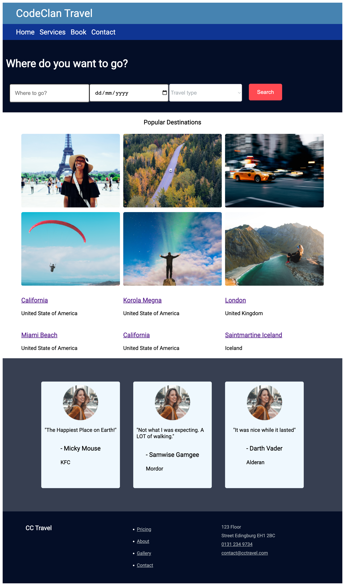

# CSS Lab

### Learning Objectives

- Be able to create a web design using HTML and CSS
- Practice translating an image into a web page
- Be able to apply aesthetic CSS rules to a web page

### Instructions

Your task is to add CSS to the `style.css` file so that the end result looks like this:

Follow the inline instructions in `style.css`

## Tips 

- Open the index.html using LiveServer (https://marketplace.visualstudio.com/items?itemName=ritwickdey.LiveServer)
- Consider having your code on one half of the screen and the browser on the other half so you can see the changes take effect

### Alternative Exercise

As an alternative to the above exercise, pick a website and create an HTML/CSS clone of it's homepage. If you're unsure try cloning one of the following:

- https://www.gov.uk
- https://www.shopify.co.uk/free-trial?term=shopify
- https://www.microsoft.com/en-gb/

(Note: We don't have example solutions to these)

## Tips

- If you need images you can use https://unsplash.com/ or similar
- If you need icons consider using https://fontawesome.com/
- Don't try to implement carousels or other complex moving parts

## Resources

- HTML5 Cheat Sheet: https://www.wpkube.com/html5-cheat-sheet/
- MDN - Using HTML Sections & Outlines: https://developer.mozilla.org/en-US/docs/learn/css
- CSS-Tricks - [A Complete Guide to Flexbox](https://css-tricks.com/snippets/css/a-guide-to-flexbox/)
- CSS-Tricks - [A Complete Guide to Grid](https://css-tricks.com/snippets/css/complete-guide-grid/)
