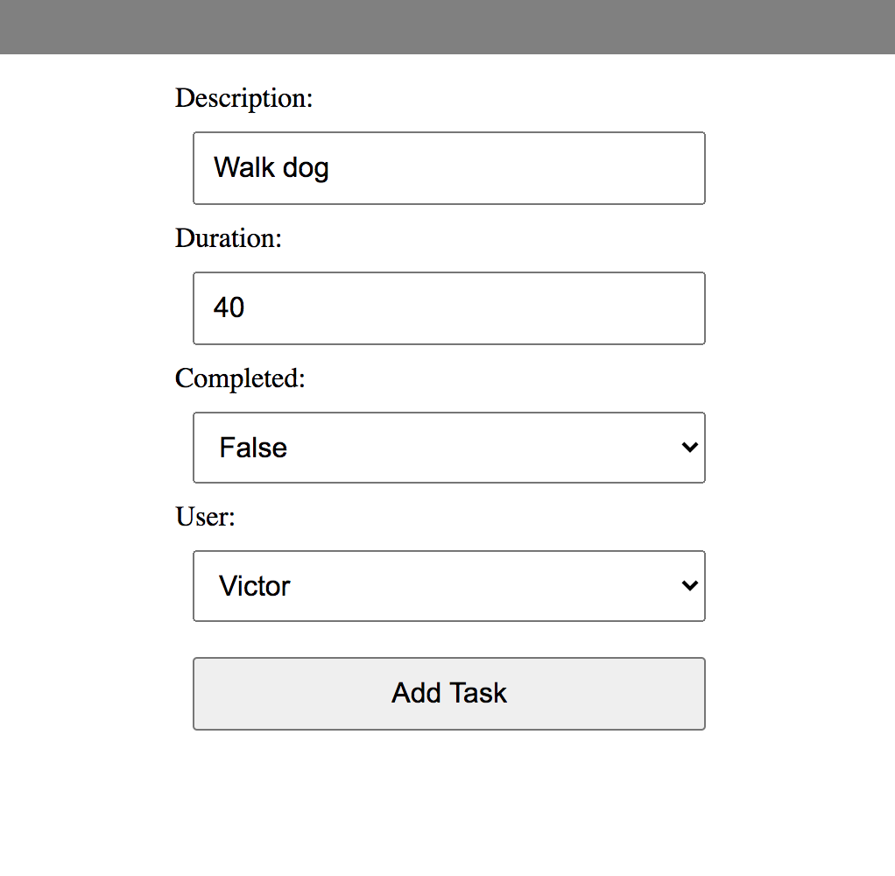
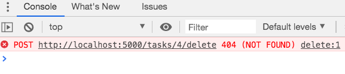

# Full Stack 'Task List' App: Part 2

#### Objectives

* Know how to implement the RESTful routes for a resource

## Resources

A web resource, or simply resource, is any identifiable thing, whether digital, physical, or abstract. In our case we'll refer to a Task as a resource.

For any given resource we usually want to be able to do CRUD operations on it. Our HTTP routes provide an interface for a user to execute these operations.

## Creating a Task

Let's look again at the comments we added to `tasks_controller`.

```python
# controllers/tasks_controller.py

# NEW
# GET '/tasks/new'

# CREATE
# POST '/tasks'

# SHOW
# GET '/tasks/<id>'

# EDIT
# GET '/tasks/<id>/edit'

# UPDATE
# PUT '/tasks/<id>'

# DELETE
# DELETE '/tasks/<id>'

```

In order for a user to add a new Task to the database, they'll need an HTML form to fill in the details. The NEW route will respond with a new form. When the user submits the form, we'll make a POST request to the CREATE route. So these two routes work hand in hand.



```python
# controllers/tasks_controller.py

# NEW
# GET '/tasks/new'
# Returns an HTML form to the browser

# CREATE
# POST '/tasks'
# Receives the data from the form to insert into the database
```

First of all, let's add a hyperlink to our navigation menu. This will make a request to our NEW route.

```html
# templates/base.html

<nav>
  <ul class="menu">
    <li><a href="/">Home</a></li>
    <li><a href="/tasks">Tasks</a></li>
    <li><a href="/tasks/new">New Task</a></li> # NEW
  </ul>
</nav>

```

Error! If we refresh the browser we'll get an error because the new_task function doesn't exist yet. Let's add it to the tasks_controller.

```python
# controllers/tasks_controller.py

# GET '/tasks/new'
@tasks_blueprint.route("/tasks/new", methods=['GET']) # NEW
def new_task(): # NEW
     return render_template("tasks/new.html") # NEW
```

Error! If we click on the `New Task` link we'll get another error. Template not found. Let's use the error messages to guide us. We need to create a new.html template.

```bash
touch templates/tasks/new.html
```

```html
# templates/tasks/new.html




Add the form here


```

Our form will need inputs for the same fields we have in our database. Remember, the database create the ID for use automatically so we won't need an input field for that.

- description
- duration
- completed
- user_id

```html
# templates/tasks/new.html


<form action="/tasks" method="post">
  <div>
    <label for="description">Description:</label>
    <input type="text" id="description" name="description" placeholder="Description" required autofocus>
  </div>

  <div>
    <label for="duration">Duration:</label>
    <input type="number" id="duration" name="duration" placeholder="Duration" required>
  </div>

  <div>
    <label for="completed">Completed:</label>
    <select id="completed" name="completed">
      <option value="true">True</option>
      <option value="false">False</option>
    </select>
  </div>

  <div>
    <label for="user">User:</label>
    <select id="user" name="user_id">
      <!-- TODO -->
    </select>
  </div>

  <button type="submit">Add Task</button>

</form>

```


# What about the User?

We've got a problem to solve here. We need a list of users to populate the User dropdown. How do you think we'll get them?

Somehow we'll have to make a query to the database and make the users available to the form in the template.

We'll use our user_repository to select all the users from the database and we'll do it in our tasks_controller.py

We'l have to import the user_repository and then select all the users in our new_task method.


```python
# controllers/tasks_controller.py

from flask import Flask, render_template
from flask import Blueprint
import repositories.task_repository as task_repository
import repositories.user_repository as user_repository # NEW

# ... AS BEFORE

def new_task():  
    users = user_repository.select_all() # NEW
    return render_template("tasks/new.html", all_users = users) # UPDATED

```

We now have all the users available to the template so we can use a loop to generate HTML option elements in the select dropdown for the users.

```html
# templates/tasks/new.html

# ... AS BEFORE

<div>
  <label for="user">User:</label>
  <select id="user" name="user_id">
     <!-- NEW -->
      <option value="{{ user.id }}">{{ user.first_name }}</option> <!-- NEW -->
     <!-- NEW -->
  </select>
</div>

```

Ok now we have to move to the backend of the app to add the CREATE route in our tasks_controller.py.
First let's grab a few more objects from the Flask package. We'll need the `request` object in order to access the data that's been sent from the HTML form. And we'll need the `redirect` object so we can redirect the user's browser to the index page once the new task has been added.

We'll also need the Task model so we can instantiate a new Task object.


```py
# controllers/tasks_controller.py

from flask import Flask, render_template, request, redirect # UPDATED
from models.task import Task # NEW
```

Now let's implement our CREATE route and then talk through what the code is doing.

```py
# controllers/tasks_controller.py


# CREATE
# POST '/tasks'
@tasks_blueprint.route("/tasks",  methods=['POST'])
def create_task():
    description = request.form['description']
    user_id     = request.form['user_id']
    duration    = request.form['duration']
    completed   = request.form['completed']
    user        = user_repository.select(user_id)
    task        = Task(description, user, duration, completed)
    task_repository.save(task)
    return redirect('/tasks')
```

Because this is route is listening for a POST request we are including POST in the list of allowed HTTP methods for this path `methods=['POST']`

`request.form` gives us access to all the values that the user added to the form inputs.

Then we create a new `User` object based on the `user_id` and pass it to the `Task` constructor along with all the other values that make up a `Task` object. Finally we use the `task_repository` to save it to the database and redirect the browser to the INDEX of tasks.

That's our NEW and CREATE routes complete!

## Deleting a task

Let's add a user action to delete a task. We're going to add it to the INDEX page. If we look back at our RESTful routes, we know we'll have to make an HTTP DELETE request from the front end.


## HTML Limitations

There's a limitation in the HTML specification that dictates that HTML Forms can only make POST or GET requests. WE won't go into why that is but for further reading check out <a href="https://softwareengineering.stackexchange.com/questions/114156/why-are-there-are-no-put-and-delete-methods-on-html-forms">this post</a> on StackExchange.

So we need a work around, and that means we'll use a FORM with a POST method to delete a task. Let's add a small form on the index page, one for each task. It will go inside the loop.

```html
# templates/tasks/index.html

<div class="buttons">

  <form class="delete-form" action="/tasks/{{task.id}}/delete" method="POST"> <!-- NEW -->
    <button class="trash-button"><i class="fa fa-trash-o fa-3x" style="color:red" aria-hidden="true"></i></button> <!-- NEW -->
  </form> <!-- NEW -->

  
    <i class="fa fa-check fa-2x" style="color:green" aria-hidden="true"></i>
  
    <i class="fa fa-times fa-2x" aria-hidden="true"></i>
  
</div>

```

If we try clicking on the delete button, we'll get a 404 (NOT FOUND) response from the server. Let's use this to guide us. What do we need to do to fix this?




We'll need to implement a DELETE route in our tasks_controller.

```python
# controllers/tasks_controller.py

# ... AS BEFORE

# DELETE
# DELETE '/tasks/<id>'
@tasks_blueprint.route("/tasks/<id>/delete", methods=['POST'])
def delete_task(id):
    task_repository.delete(id)
    return redirect('/tasks')

```

The task is now deleted! To double check, look at the tasks table in the database to make sure it's been deleted.

We have three more routes to implement.

```python
# controllers/tasks_controller.py

# SHOW
# GET '/tasks/<id>'

# EDIT
# GET '/tasks/<id>/edit'

# UPDATE
# PUT '/tasks/<id>'

```

## Showing a task

Let's add an anchor tag to the description of each task on our INDEX page that will link to a show page. A show page should only display the details of a task resource.

```html
# templates/tasks/index.html

<a href="/tasks/{{task.id}}">{{task.description}}</a> <!-- UPDATED -->

```

We'll need a new HTML template.

```bash
touch templates/tasks/show.html
```

```html
# templates/tasks/show.html




  <div>
    <p>{{task.description}}</p>
    <hr>
    <p>{{task.user.first_name}}</p>
    <p>{{task.duration}} mins</p>
    <p>Completed? {{task.completed}}</p>
    <p><a href="/tasks/{{task.id}}/edit">Edit</a></p>
  </div>



```

And we'll implement the SHOW route in our controller.

```python
# controllers/tasks_controller.py

# SHOW
# GET '/tasks/<id>'
@tasks_blueprint.route("/tasks/<id>", methods=['GET'])
def show_task(id):
    task = task_repository.select(id)
    return render_template('tasks/show.html', task = task)
```

## Editing a task

To edit a task we'll need a form that's similar to the NEW form. We'll pre-populate it with the details of one task. But first we'll need to implement the EDIT route to return a form to the browser.

```bash
touch templates/tasks/edit.html
```

```python
# controllers/tasks_controller.py

# EDIT
# GET '/tasks/<id>/edit'
@tasks_blueprint.route("/tasks/<id>/edit", methods=['GET'])
def edit_task(id):
    task = task_repository.select(id)
    users = user_repository.select_all()
    return render_template('tasks/edit.html', task = task, all_users = users)

```

Let's look at the code for the EDIT form and then talk through some key points.

```html
# templates/tasks/edit.html




<form action="/tasks/{{task.id}}" method="post">
  <div>
    <label for="description">Description:</label>
    <input type="text" id="description" name="description" value="{{task.description}}" required autofocus>
  </div>

  <div>
    <label for="duration">Duration:</label>
    <input type="number" id="duration" name="duration" value="{{task.duration}}" required>
  </div>

  <div>
    <label for="completed">Completed:</label>
    <select id="completed" name="completed">

      <option value="true"
         selected="selected" >
        True
      </option>

      <option value="false"
         selected="selected" >
        False
      </option>

    </select>
  </div>

  <div>
    <label for="user">User:</label>
    <select id="user" name="user_id">
      
        <option value="{{ user.id }}"
           selected="selected">
          {{ user.first_name }}
        </option>
      
    </select>
  </div>

  <button type="submit">Update Task</button>

</form>



```

## Pre-populating

Let's take the Description input for example.

```html
<input type="text" id="description" name="description" value="{{task.description}}" required autofocus>
```

We're setting the value of this input to be the description of the task. We do the same for the duration input.

For the completed select dropdown and the user select dropdown we have to use a conditional to either display the `selected` HTML attribute or not. We do the same for the user dropdown.

```html
<select id="completed" name="completed">

  <option value="true"
     selected="selected" >
    True
  </option>

  <option value="false"
     selected="selected" >
    False
  </option>

</select>
```


## Updating a task

Let's look at what route is going to be requested when the user clicks the updated button.

```html
<form action="/tasks/{{task.id}}" method="post">
```

When the update button is clicked, the browser will make a POST request to `/tasks/{{task.id}}`

If we're updating task number 4 for example, then the path would be `/tasks/4`

We'll need to create our final route in the tasks_controller.

```python
# controllers/tasks_controller

# UPDATE
# PUT '/tasks/<id>'
@tasks_blueprint.route("/tasks/<id>", methods=['POST'])
def update_task(id):
    description = request.form['description']
    user_id     = request.form['user_id']
    duration    = request.form['duration']
    completed   = request.form['completed']
    user        = user_repository.select(user_id)
    task        = Task(description, user, duration, completed, id)
    task_repository.update(task)
    return redirect('/tasks')
```

What's happening here? Just like the CREATE route, we're grabbing the values that the user input into the HTML form. Then we select the correct user from the database and instantiate a Task object. Then we use the task_respositry to update the row in the tasks table.


## Summary

We've now completed all the RESTful routes needed for a fully functioning CRUD app. Bear in mind that not ALL applications will require all of this functionality and will most likely require additional functionality out with the RESTful routes.

A route is the combination of a an HTTP method and a path. For example the CREATE route responds to a POST request to /tasks. The INDEX route responds to a GET request to /tasks.

Sticking to the RESTful routes gives us a convention and pattern to use that saves us having to decide what to call our routes and also brings a level of consistency.
