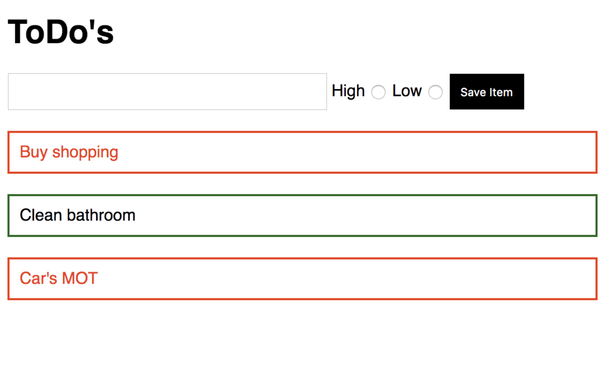

# Homework: ToDo List

## Learning Objectives

- Be able to create a basic React application
- Be able handle and display state
- Be able to use a simple form

## Brief

Your task is to create a todo list application that allows a user to save an item to a list which then renders on the page.

Use React to build a solution that looks like this:



## MVP

- Render a list of todos from an array of strings.  
- Add the capability to add a new todo to the list.

Your todos array would look something like:
```js
todos: [
	"Buy shopping", "Clean bathroom", "Car's MOT"
]
```

## Extensions

- Update the todos array to take in objects with keys of name and priority.
- Add radio buttons to track the level of priority
- Give the user visual feedback on what todos are high priority 

Your updated todos array might look like this: 
```js
  [
    { name: "Buy shopping", priority: "high" },
    { name: "Clean bathroom", priority: "low" },
    { name: "Car's MOT", priority: "high" }
  ]
```
