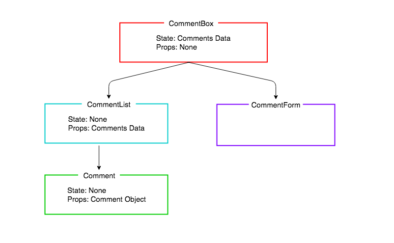

# React Comments

## Learning Objectives

* Create a multiple component React application
* Understand the difference between state and props
* Learn how to pass data between components

## Introduction
Yesterday we created an application with a single component, and our state and logic lived in that one component, `app.js`. However, as a developer, its important for us to follow the single responsibility principle as much as possible. In React, we can follow this by breaking down our interfaces into smaller chunks or smaller components. A component will be responsible for one part of our user interface, and the great thing about components is, they can be re-usable! This will make our code DRY.

We are going to create an application that displays a list of comments where users can add new comments via a form. We will be using multiple components, and even reusing components when we can.

## Application Structure

When planning a React app, we divide up the UI into separate components, with each component responsible for rendering a section of the UI. This is what our component structure is going to look like.


*Comments Application Component Structure*

`CommentsBox` will be appended to the HTML root element by React. Then there will be nothing more we need to add to our HTML, the whole application will be drawn by Javascript using React. We do this by describing components for our UI in a component **_hierarchy_**. Any component rendered by another is called the child of its parent component.



*Comments Application Component Hierarchy*

In this lesson we will only be concentrating on the left-hand side of the diagram, rendering a list of comments. In the next lesson we will be adding a form, and updating the state, but it's important to think about the whole application at this point in our planning, because we need to decide which components will have what data for their state and props.

### Props 

Props (or properties) are attributes that are given to a component by their parent component. They basically act like arguments for a function. A key difference between props and state is that **Props cannot be changed**, they are immutable. Props enable us to pass data from one component to another. We will be using props a lot during this lesson. 

You can see the state and props have already been added to the diagram. The application state is kept high in `CommentBox`. The reason we keep the state high in our React applications is because of React's one-way data flow. We do not pass data across the hierarchy chains in React (unlike with other patterns such as PubSub). Therefore, by keeping the comments data at the top level, all the rendering chains can have access to it: the `CommentForm` can update the data, and the `CommentList` and `Comment`s can be re-rendered with new comments as they are added to the collection. The way we are able to pass our state data down the component hierarchy is through props. 


As we are not adding the form until the next lesson, in this lesson we will be building a static application that will render based on a hard coded array of comments. This is often a good place to start with a React application.

### Create React App Boilerplate

Let's use `create-react-app` to bootstrap our application, then remove the logo and unneccessary boilerplate code.

```bash
npx create-react-app comments
cd comments
npm start

# cmd-t, new tab
cd src
rm logo.svg
```

```js
// 

import React from "react";
									// DELETED
import "./App.css";

function App() {
  return (
    <h1>Hello World!</h1> 			// MODIFIED
  );
}

export default App;
```

## Containers and Components

We are about to build our first Component, the `CommentBox`. We could put all our components directly in the 'src' folder, but we are going to separate our components into two categories in order to give our application a bit more structure: `containers` and `components`.

Both will contain React `Components`, but by convention if a component contains logic or holds application state we will put it in the `containers` directory. If a component just contains presentational code, it will go inside the `components` directory.

1. `containers` - Components with logic or application state
2. `components` - Components with presentational code

> Note: The difference between a container and component is not strictly black and white, but with more experience we will see some more of the differences.

Let's make those directories:

```sh
mkdir src/components
mkdir src/containers
```

The approach we are going to take it to create the chain of components and check that each one renders the next, before implementing any of the components' details.

Let's start with the top of the hierarchy, the CommentBox. Because the CommentBox is going to hold our application state it will go in the `containers` directory:

```sh
touch src/containers/CommentBox.js
```

```js
// src/containers/CommentBox.js

import React from "react";

const CommentBox = () => {

  return (
    <h1>I'm a CommentBox!</h1>
  );

}

export default CommentBox;
```

To get this to render to the page, we need to tell `App` to render it.

```js
import React from "react";
import CommentBox from "./containers/CommentBox"; // NEW

function App() {
  return (
  	<CommentBox /> 		// MODIFIED
  )
}

export default App;
```

Now we work our way down the hierarchy, next making the CommentList. The comment list won't store application state, its sole responsibility will be to receive data from `CommentBox` and render a collection of `Comment` components.

```sh
touch src/components/CommentList.js
```

```js
// src/components/CommentList.js

import React from "react";

const CommentList = () => {

  return (
    <p>I'm a CommentList!</p>
  )

}

export default CommentList;
```

For it to be displayed on the page we need to tell our `CommentBox` component to render it. Let's also add a title to our page in the form of an `h1`.

```js
// src/containers/CommentBox.js

import React from "react";
import CommentList from "../components/CommentList";		// NEW

const CommentBox = () => {

  return (
    <>
      <h1>Comments</h1>					// MODIFIED
      <CommentList />					// NEW
    </>
  );

}

export default CommentBox;
```

## Comment Component

The last component in our hierarchy is the `Comment` component and as it is only responsible for receiving data and rendering it to the screen it will go in the `components` directory.

```sh
touch src/components/Comment.js
```

```js
// src/components/Comment.js

import React from "react";

const Comment = () => {

  return (
    <p>I'm a Comment!</p>
  )

}

export default Comment;
```

By the end of this lesson our `CommentList` is going to dynamically render the collection of comments we pass to it, but for now we are going to hard code a couple of `Comment` components to ensure we don't have any errors in the presentation code.

```js
// src/components/CommentList.js

import React from "react";
import Comment from "./Comment";		// CHANGED

const CommentList = () => {

  return (
    <>
      <Comment />						// NEW
      <Comment />						// NEW
    </>
  )

}

export default CommentList;
```

We should now see those two comments being rendered to the screen. Next let's populate the comments with some text. Again, by the end of the lesson this content for each comment will be stored in the collection of data, but for now we will hard code the values in to ensure our `Comment` component is rendering it properly.

Let's pass the author and comment to the `Comment` component as props. We define the prop in JSX like we set attributes on an HTML component, but we get to define the name of the prop (we will use 'author'). We can either pass the prop as a string or use the braces ({}) to pass in other JavaScript values.

 The comment text we are going to use a special kind of property, called `children`. The `children` props refers to any text or elements passed between the JSX opening and closing tags.

```js
// src/components/CommentList.js

//...
return(
    <>
      <Comment author = "Rick Henry">React is such a great framework!</Comment>		// MODIFIED
      <Comment author = "Valerie Gibson">I'm dreaming in React...</Comment>			// MODIFIED
    </>		
  )
 //...

```

## Destructuring

When we pass props to a component like this we can pass as many or as few as we like. Regardless of how many there are, they are sent to the child component in an object called props. This is just a JavaScript object and can be accessed in the same way as any other, ie. to get to our Comments's author prop we would look for props.author. Or for the comment in between the tags, it will be props.children. This is fine for a small app like this, but as our apps get larger and we pass more and more props to our component it will hinder both reading and writing our code if we have to write props.ourProp everywhere.

Destructuring will help us here, just like it did for useState. Destructuring is a JavaScript feature that lets us unpack values from arrays, or properties from objects, and assign them to variables i.e we can use it to extract data from arrays and objects.

By destructuring the props object when we define our component's parameters we can access them simply by typing the name of the prop. With our Comment we do this by placing author and children within braces in the function definition, then simply using title where we want to access it:

Let's now modify our `Comment` component to render this information. We'll destructure the props object to access `author` and `children`

```js
// src/components/Comment.js

import React from "react";

const Comment = ({author, children}) => {			// MODIFIED

  return(
    <>
      <h4>{children}</h4>					// NEW
      <p>{author}</p>						// NEW
    </>
  )

}

export default Comment;
```

Now we can see our comments being rendered to the page!

## Data Model

We have hard coded the data in a list of comments. We now want to create an array of comments which will be dynamically rendered by the `CommentList`. We are going to set up our `CommentBox` to be in control of the data. For now it will just store the data, later, when we add a form, it will be responsible for adding new comments to it.

## State

Our `CommentBox` is going to be the master of the state of our application, the array of comments. For now we'll just make some mock data, although we could get this from an API or database. We'll use `useState` to initialise it:

```js
// src/containers/CommentBox.js

import React, {useState} from "react";					// MODIFIED
import CommentList from "../components/CommentList";

const CommentBox = () => {

  const [comments, setComments] = useState(				// NEW
    [
      {
        id: 1,
        author: "Rick Henry",
        text: "React is such a great framework!"
      },
      {
        id: 2,
        author: "Valerie Gibson",
        text: "I'm dreaming in React..."
      }
    ]
  )

	return (
  // ...
}
```

And let's pass the data as props to the `CommentList` component so it can render it, on the key `comments`.

```js
// src/containers/CommentBox.js

  // ...

    return (
      <>
        <h2>Comments</h2>
        <CommentList comments={comments} /> // UPDATED
      </>
    );
}

```

To check this has worked, if you looking in React Dev Tools and click on:
- `CommentBox` you should see it has the array `comments` as state.
- `CommentList` you should see it has the array `comments` as props.

## Dynamic Rendering of Data

The `CommentList` has no state, it just has the comments data it has been given by the `CommentBox`. Inside `CommentList` we are going to `map` the array of comment objects (`comments`) into an array of `Comment` components.

```js
// src/components/CommentList.js

import React from "react";
import Comment from "./Comment";

const CommentList = ({comments}) => {									// MODIFIED

  const commentNodes = comments.map(comment => {						// NEW
    return (															// NEW
      <Comment author={comment.author}>{comment.text}</Comment>			// NEW
    );																	// NEW
  });																	// NEW

  return(
    <>
      <Comment author = "Rick Henry">React is such a great framework!</Comment>
      <Comment author = "Valerie Gibson">I'm dreaming in React...</Comment>
    </>
  )

}

export default CommentList;
```

We can now return our new array of `Comment` components (`commentNodes`), rather than the hard coded comments.

```js
// src/components/CommentList.js

import React from "react";
import Comment from "./Comment";

const CommentList = ({comments}) => {

  const commentNodes = comments.map(comment => {
    return (
      <Comment author={comment.author}>{comment.text}</Comment>
    );
  });

  return(
    <>
      {commentNodes}							// MODIFIED
    </>
  )

}

export default CommentList;
```


## The `key` Property

You will see there is a warning in the browser console, asking that you give each item in a list a unique identifier on the `key` property. This is because React wants to use its virtual DOM to only re-render specific list items when they change, rather than having to re-render the whole list. By giving each component in the array a unique key, we can solve this problem.

```js
// src/components/CommentList.js

  // ...
const commentNodes = comments.map(comment => {
    return (
      <Comment author={comment.author} key={comment.id}>{comment.text}</Comment>			// MODIFIED
    );
  });
  // ...
}

```

Great, we have created a static application that renders a list of comments! Now we have everything in place to add a form and use the power of React's re-rendering to update the page for us every time a new comment is added.

## Conclusion

We have seen how to plan the structure of our React applications by creating a hierarchy of components that are each responsible for rending one part of the UI. We have also seen how we can pass a collection of data as props, and to render it dynamically.
