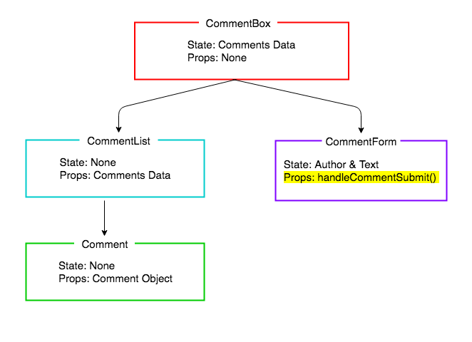

# React Comments Form

## Learning Objectives
- Be able to add a form to a React component
- Be able to pass callbacks between components as props
- Know how and when to trigger a re-render

## Introduction

In the previous lesson we made a static application that renders a list of comments. Now let's look at how we can update our list with a new comment submitted by a user. To do this we need to alter the state of our application when the new comment gets submitted, causing a re-render.

## Adding new Comments

We are already displaying a list of comments, but that's only half of our desired functionality. Now we would like to be able to add comments. Let's create a form component:

```sh
touch src/components/CommentForm.js
```

Let's create a form with author and text fields. The JSX syntax is again, very similar to the HTML syntax for a form.

```js
// src/components/CommentForm.js

import React from "react";

const CommentForm = () => {

  return (
    <form>
      <input 
        type="text"
        placeholder="Your name"
      />
      <input 
        type="text"
        placeholder="Say something..."
      />
      <input 
        type="submit"
        value="Post"
      />
    </form>
  )

}

export default CommentForm;
```

And let's import `CommentForm` into `CommentBox` and tell our `CommentBox` to render the form:

```js
// src/containers/CommentBox.js

import React, {useState} from "react";
import CommentList from "../components/CommentList";
import CommentForm from "../components/CommentForm";				// NEW

const CommentBox = () => {

// ...

  return (
    <>
      <h1>Comments</h1>
      <CommentList comments={comments} />
      <h2>Add a comment:</h2>										// NEW
      <CommentForm />												// NEW
    </>
  );

}

export default CommentBox;

```

## React Controlled Components

React documentation suggests that when we are creating a component that contains user inputs, such as a form, it should have state that keep's track of the values of the inputs. This might seem odd, as we have been working to the principle that all the state lives at the top of the application, but this is an exception. The form component will keep track of its own state.

[link to React Controlled Components](https://facebook.github.io/react/docs/forms.html)

The idea is that the form component has state which reflects the current state of the inputs, and this state is the single source of truth for the whole component. Anywhere we need to access the values of the form, we access them from the state. There is a more general idea that state should be as high up the component hierarchy as it needs to be. In this case there is no need for any components other than the form to know about what should be in the input boxes, so the state doesn't need to go any higher.

Let's set it up with `useState`:

```js
// src/components/CommentForm.js

import React, {useState} from "react";				// MODIFIED

const CommentForm = () => {

  const [author, setAuthor] = useState("");			// NEW
  const [text, setText] = useState(""); 			// NEW

  return (

  // ...
}

```

We can modify the form to display those state values.

```js
// src/components/CommentForm.js

// ...

return (
<form className="comment-form">
  <input
    type="text"
    placeholder="Your name"
    value={author} 								// NEW
  />
  <input
    type="text"
    placeholder="Say something..."
    value={text} 								// NEW
  />
  <input type="submit" value="Post" />
</form>
)

export default CommentForm;

```

So now when we look at the page, when we type in the fields the values don't change. This is because they are always displaying the state, which isn't being updated. Let's now update the state as the user types.

We will write two functions, one for updating 'author' and the other for updating 'text'. Then we will pass these functions to the `onChange` listener of the `input`s. This means as the user types, the `input`s' `onChange` listener will be called and the state will be updated.

```js
// src/components/CommentForm.js

// ...

const handleAuthorChange = (evt) => {			// NEW
    setAuthor(evt.target.value);
  }

  const handleTextChange = (evt) => {			// NEW
    setText(evt.target.value);
  }

  return (
    <form>
      <input 
        type="text"
        placeholder="Your name"
        value={author}
        onChange={handleAuthorChange}			// NEW
      />
      <input 
        type="text"
        placeholder="Say something..."
        value={text}
        onChange={handleTextChange}				// NEW
      />
      <input 
        type="submit"
        value="Post"
      />
    </form>
  )

}

export default CommentForm;
```

Now our form inputs display the value correctly. If we check the dev tools, we'll see that the values stored in state for `CommentForm` are updating too. Now we want to write a function that is called then the submit button it clicked. It's going to have two responsibilities:

1. Do any form validation. In our case, checking if either field has been left empty
2. Update the list of comments with the new comment
3. Reset the form's input fields


First let's do the form validation, accessing the form's values from the state.

```js
// src/components/CommentForm.js

// ...

  const handleFormSubmit = (evt) => {
    evt.preventDefault();
    const authorToSubmit = author.trim();
    const textToSubmit = text.trim();
    if (!authorToSubmit || !textToSubmit){
      return
    }
  }
// ...

```

Next we want to update the state in `CommentBox`, adding the new comment. We are going to do this last, so for now we will put in a 'to-do' comment.


```js
// src/components/CommentForm.js

// ...

  const handleFormSubmit = (evt) => {
    evt.preventDefault();
    const authorToSubmit = author.trim();
    const textToSubmit = text.trim();
    if (!authorToSubmit || !textToSubmit){
      return
    }
    // TODO: Update comments in CommentBox
  }
  
 // ...

```

Lastly, we will reset the form fields to be empty, by resetting our form value's single source of truth: the state.

```js
// src/components/CommentForm.js

const handleFormSubmi t= (evt) => {
  evt.preventDefault();
  const author = author.trim();
  const text = text.trim();
  if (!text || !author) {
    return
  }
  
  // TODO: Update the list of comments

  setAuthor("");  // ADDED
  setText("");    // ADDED
}
```

Before we complete the final step of updating the state with the new comment, let's add this method to the form's `submit` event, and check it works.

```js
// src/components/CommentForm.js

// ...

return (
  <form className="comment-form" onSubmit={handleFormSubmit}> 		// MODIFIED
  // ...
)

```


Now we should see the form resets every time you submit the form. If we look in React Dev Tools, we should also see the `CommentForm`'s state being reset each time.

So our final step is to update the `CommentBox`'s state with the new comment.

## Updating the Comment List

When a user submits a comment, a new comment should be added to our list of our comments. The collection of comment data is being stored in the `CommentBox`, and we have access to our new comment in `CommentForm`. So you might be wondering, considering React has a one-way data flow, how can the `CommentForm` update the state in `CommentBox`? The answer is that we define a function in `Commentbox` (`handleCommentSubmit`) that is responsible for updating the data. Then we pass the function, via props, to `CommentForm` so that it can invoke it, passing in the new comment. This is just the same as passing any callack in JavaScript, the only different being, we pass it via props from one component to another.



*Callback Passed as a Props*

When a user submits the form, the state of our application should change and thus the whole page should re-render. As our CommentBox is at the top of the chain this will cause a cascade re-rendering our whole display. It is here we will start to see the benefits of the one-way flow design.

This is going to be a three step process:

1. Define the callback (`handleCommentSubmit`) in `CommentBox`. The callback will take a new comment as an argument, and add it to the state.
2. Pass the callback (`handleCommentSubmit`) via props to `CommentForm`.
3. Call the callback, passing in the new comment object.

**Step 1**: defining the callback.

The callback will take a new comment as an argument, and add it to the state.

We always change the state using the function returned by `useState`, which means we can't just `push` the new comment onto the array. We have to create a new array, modify it, then use our `setComments` function. We're going to use the *spread operator* to help us. This is a new es6 feature which is perfect for just this case; is separates all the elements of one array into a new array. We can add the new comment to the new array at the same time.

```js
// src/containers/CommentBox.js

//...

  const addComment = (submittedComment) => {
    submittedComment.id = Date.now();
    const updatedComments = [...comments, submittedComment];
    setComments(updatedComments);
  }

//...

```

> Note: The comments need an `id` as we are using the for the `key` property on the `Comment` components. They need to be unique, so for now we will use the date. We should use a hashing function or id generated by a database.

**Step 2**: Passing the callback as props.

```js
// src/containers/CommentBox.js

return (
    <>
      <h1>Comments</h1>
      <CommentList comments={comments} />
      <h2>Add a comment:</h2>
      <CommentForm onCommentSubmit={(comment) => addComment(comment)}/>				// MODIFIED
    </>
  );
```

**Step 3**: Invoking the callback, passing in the new comment object.

Now we want the `CommentForm` to call this function when a comment is submitted.

```js
// src/components/CommentForm.js
const CommentForm = ({onCommentSubmit}) => {

// AS BEFORE

const handleFormSubmit = (evt) => {
    evt.preventDefault();
    const authorToSubmit = author.trim();
    const textToSubmit = text.trim();
    if (!authorToSubmit || !textToSubmit){
      return
    }

    onCommentSubmit({						// NEW
      author: authorToSubmit,				// NEW
      text: textToSubmit					// NEW
    });

    setAuthor("");
    setText("");
 }
```

Fantastic, we have our application dynamically updating using the React one way flow. Now when a user submits a comment using the form, the list of comments is updated on the page.

## Conclusion

Updating state in the top level component by a component further down the chain is done by passing a callback as props. When the callback is invoked it sets state and the page is re-rendered with the new information.

We have also seen how to create Controlled Components for components with inputs, that have a single source of truth for the form values.
