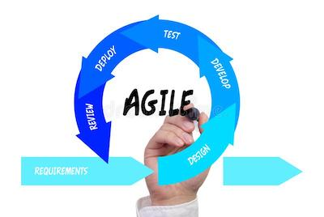
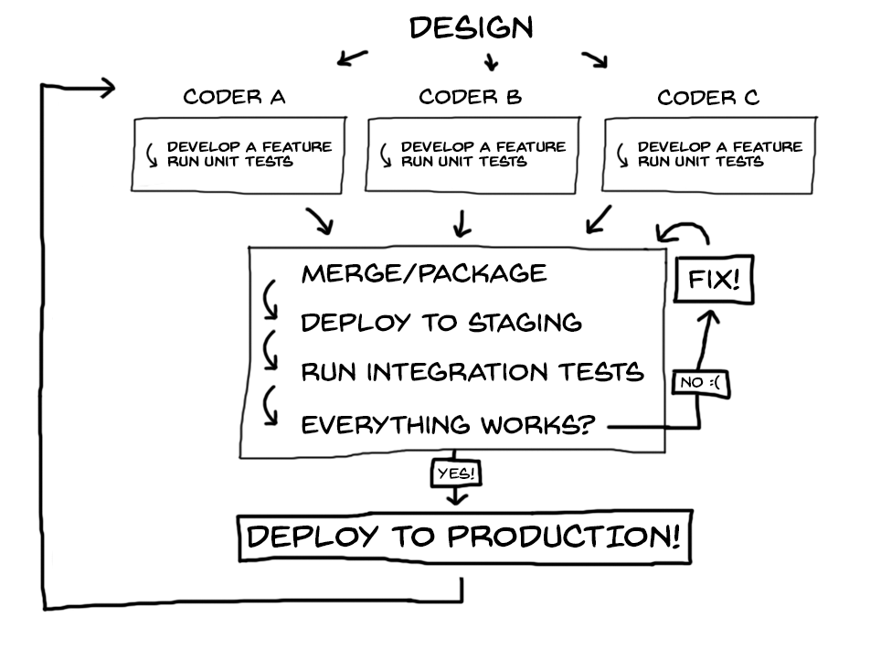

# The DevOps Story 

> Objective is to give students an overview of DevOps and Cloud and some of the leading technologies involved

> Put the students into groups, move the desks around so they are working in clusters

> Use a whiteboard liberally!

## Waterfall & Agile

Imagine you just started as a senior engineer for Twitazon 6 months ago and are now in charge of a department of 10 people, responsible for the delivery of the core application.

You've been called into your boss's office for a dressing down. The team has failed to release a single new feature in the 6 months that you've been in charge and **your job is on the line**. You have 2 months to turn it around otherwise you're fired.

Until now, your team have been using a waterfall methodology in their work and it hasn't been working very well. Gathering requirements, spending months writing code, testing it and then getting it approved has resulted in zero new features for your boss. 

These days, a company like Amazon will deploy new code several times every minute. Imagine trying to get that done with our step-by-step waterfall workflow! It's just impossible. 

You think to yourself: *"I know there are better ways to do this. We've been using waterfall for our Software Development Lifecycle. I know that Agile is a thing and Scrum and the Cloud are a things too."*  


### Student group task 
  
  ```
  Prepare a short presentation to explain what the Agile SDLC is and why it's essential these days. One group will be chosen at random to present their findings.
  ```

### Solution 
  
  - Implementing an Agile SDLC is essential if you are to develop, test and release working software regularly

  - Agile is essential these days otherwise too much time is spent developing something that might not meet customer needs. Making changes and improvements frequently and easily is the goal. This can't be achieved with a waterfall approach.

> Draw on board




## What is DevOps?

> Optional listening: https://www.redhat.com/en/command-line-heroes/season-1/devops-tear-down-that-wall

Luckily, you found a comprehensive presentation on Agile and the SDLC. Understood. Agile puts a premium on **constant iterative improvements**. But now, you're wondering how you can help your developers actually do this. 

Currently, You have a developer team and an operations team. The developers write the code and the operations team manage the release of that code as well as managing the in-house servers.

Your team have two opposing goals. The developers want to make changes and the operations team want to minimise changes.

You see a big wall. The wall stretches as far as you can see to the right and all the way off to the left. It's taller than everyone, and there are people on both sides. But are they friends or enemies?

Developers create their code and throw it over the wall to operations, and then it's operations' problem. Not good.

So you jump on Google and after a while discover something called **DevOps** which apparently goes hand in hand with Agile. But it's full of jargon! You need to understand it all and find a starting point. 

You sketch out a process that you think makes sense based on your research so far:

> Draw on board



<cite>Image from www.logrocket.com</cite>

### Student group task

> Resource of DevOps/Agile relationship: https://cloudacademy.com/blog/devops-agile-relationship/

```
You need to research and find out the following:
  - What is DevOps?
  - How are DevOps and Agile related to each other?
  - What are CI and CD?
  - What is a pipeline?

  One group will be chosen at random to present their findings.
```

### Solution 

  ### What is DevOps?
  <p>DevOps is a set of practices that is intended to reduce the time between committing a change  and that change going into production while ensuring quality. Some of its key principles include end-to-end responsibility, continous improvement, constant monitoring and feedback, and also automation. It's main goal is to remove organisational "silos" - independently operating divisions that avoid sharing information with other divisions. Thus DevOps is more a mindset rather than a role - having a dedicated DevOps team goes against the idea of independent teams and can add overhead, although dedicated DevOps engineers can make deployment smoother if they are part of a self-organising team</p>


  ### How are DevOps and Agile related to each other?
  <p>They tackle different problems, but are closely connected: Agile handles the problem of building software faster, and more efficiently in small increments. DevOps provides the formula for deploying more often, with higher reliability and quality. </p>
  <p>Agile encourages independent self-organising teams - teams that can deliver features end-to-end, without the need for outside support. DevOps promotes the same idea - sharing responsibility and ownership within the team from writing the code to deploying the features and monitoring the app.</p>
  <p>Other commonly used Agile practices like pair programming can also encourage shared ownership/responsibility. The short iteration times and quick feedback loop can be halted by not being able to actually deliver these features quickly and seamlessly - another area where DevOps can help.</p>

  ### What is CI/CD? 
  <p>A way to automate your build, test and deploy tasks</p>

  ### What does CI stand for?
  <p>Continuous Integration: Continually integrating your code into the codebase. This requires constant and regular commited code changes into version control. A CI pipeline then automatically builds your app, runs the tests, and only allow merges if the added features does not break the build</p>

  ### What does CD stand for?
  <p>Continuous Deployment/Delivery: Continually releasing working software. The automated pipeline would include automated end-to-end and user acceptance tests, taking out the human component from the deployment - meaning features can be released seamlessly without the need for specific release cycles or taking down the app first.</p>

  ### What is a pipeline?
  <p>A pipeline is a set of automated processes. E.G. When a developer tries to push their code to the common codebase, then a set of unit tests need to pass</p>

## Quiz Part 1

https://docs.google.com/forms/d/e/1FAIpQLSfEzIF62DImjd5HgLI7_2pGpduoH-KToafxvYlrKH-71ZXCFg/viewform


## Making Technology Choices

All right. Now you're excited. You can see a way forward now. You've taken this strategy back to your team leads and now you have to make a choice as to what technologies you're going to use.

From your research you've found that the group of tools you need is referred to as a "DevOps Toolchain".

We can break CI/CD software into two categories:

1. Installable software: Apps or services you can install on your computer or some remote machine (e.g., Jenkins, TeamCity)

2. SaaS: Apps or services with a web interface provided by an external company (e.g., CircleCI, Azure DevOps)

You've managed to narrow it down from the massive lists of tools you found and further research is needed on the following:

- Jenkins
- CircleCI
- Ansible
- Vagrant
- GitHub
- Sentry

### Student group task

```
Research the tools on the shortlist and find out what they are used for. One group will be chosen at random to present their findings.
```

### Solution 

### Jenkins
<p>
Jenkins is a free and open source automation server. It helps automate the parts of software development related to building, testing, and deploying, facilitating continuous integration and continuous delivery. It is a server-based system that runs in servlet containers such as Apache Tomcat.
</p>

### CircleCI
<p>
CircleCI is a modern continuous integration and continuous delivery (CI/CD) platform. The CircleCI Enterprise solution is installable inside your private cloud or data center and is free to try for a limited time. CircleCI automates build, test, and deployment of software.
</p>


### Ansible
<p>
Ansible is an open-source software provisioning, configuration management, and application-deployment tool enabling infrastructure as code. It runs on many Unix-like systems, and can configure both Unix-like systems as well as Microsoft Windows.
</p>

### Vagrant
<p>
Vagrant is an open-source software product for building and maintaining portable virtual software development environments. It tries to simplify the software configuration management of virtualization in order to increase development productivity.
</p>

### GitHub
<p>
GitHub is a provider of Internet hosting for software development and version control using Git. GitHub Actions allows building continuous integration and continuous deployment pipelines for testing, releasing and deploying software without the use of third-party websites/platforms
</p>

### Sentry
<p>
 Sentry is a full stack monitoring tool that gives you full visibility into your code, so you can catch issues before they become downtime
</p>


## The Cloud, Containers & Deployment Environments

> Optional listening https://www.redhat.com/en/command-line-heroes/season-1/the-containers-derby

Now you're feeling much more confident. But that old server rack that sits in the basement? That's got to go. You're fairly sure that this is where the Cloud comes in. 

If all this is going to work, we need to get rid of our in-house servers and move our code onto the cloud. But what's the benefits of doing this? How do I justify the cost to my boss? And which one should I choose?

You've also come across the phrase 'containers' a few times now. You've also heard about 'deployment' environments. So you set out again to research some more.

### Student group task

Research the following:

- What are the benefits of cloud hosting?
- What are the top 3 cloud providers?
- What are the 4 development environments we need?
- What is Docker?
- What is Kubernetes?
- What is Amazon S3?
- What is a bucket?
- What is Amazon EC2?

### Solution 

### What are the benefits of cloud hosting?
- Flexible pricing, easily scalable resources - you can spin up more instances/servers when the demand is high, and scale it down when you experience quieter times.
- High uptime and availability - if any of the servers you're renting are experiencing technical difficulties, your app can be transferred to a working one.
- Better performance - it's easy to balance the load of requests, and large cloud providers can give you accessible servers on multiple locations - reducing latency if your product is being used all over the globe.
- Physical server issues are less impactful - simply migrate your resources to another server without downtime
- Security - although you're trusting a third party with your app and data, their solutions are often better for protection as there is dedicated security monitoring, often outperforming in-house systems.
- Dashboards, insights, metrics - Easy to access monitoring tools gives you a lot of data about your apps analytics.


### What are the top 3 cloud providers?
1. AWS (Amazon Web Services)
2. Microsoft Azure
3. Google Cloud Platform


### What are the 4 development environments we need?
1. Development
2. Testing
3. Staging
4. Production

### Docker
<p>
Docker is a set of platform as a service products that use OS-level virtualization to deliver software in packages called containers. Containers are isolated from one another and bundle their own software, libraries and configuration files.
</p>

### Kubernetes
<p>
Kubernetes is an open-source container-orchestration system for automating computer application deployment, scaling, and management. It was originally designed by Google and is now maintained by the Cloud Native Computing Foundation.
</p>

### Amazon S3
<p>
Amazon S3 or Amazon Simple Storage Service is a service offered by Amazon Web Services that provides object storage through a web service interface. Amazon S3 uses the same scalable storage infrastructure that Amazon.com uses to run its global e-commerce network.
</p>

### What is a bucket?
<p>
An Amazon S3 bucket is a public cloud storage resource available in Amazon Web Services' (AWS) Simple Storage Service (S3), an object storage offering. Amazon S3 buckets, which are similar to file folders, store objects, which consist of data and its descriptive metadata.
</p>

### What is Amazon EC2?
<p>
Amazon Elastic Compute Cloud (Amazon EC2) provides scalable computing capacity in the Amazon Web Services (AWS) Cloud. ... You can use Amazon EC2 to launch as many or as few virtual servers as you need, configure security and networking, and manage storage.
</p>

## Recap

OK, so let's recap what we've found out:

- DevOps is an essential part of working in an Agile way. If we can't develop and release well tested code quickly then it makes implementing an Agile SDLC very difficult.

- DevOps is a set of practices that is intended to reduce the time between committing a change  and that change going into production while ensuring quality

- DevOps toolchains allow developers to do Continuous Integration and Continuous Deployment 

- A pipeline is a set of automated processes. E.G. When a developer tries to push their code to the common codebase, then a set of unit tests need to pass

- We can break CI/CD software into two categories:
  1. Installable software: Apps or services you can install on your computer or some remote machine (e.g., Jenkins, TeamCity)
  2. SaaS: Apps or services with a web interface provided by an external company (e.g., CircleCI, Azure DevOps)

- We know that we should probably choose between AWS, Azure or Google Cloud for hosting our code

- We'll probably need 3 or 4 environments;
  1. Development
  2. Testing
  3. Staging
  4. Production


 ## Quiz Part 2

 https://docs.google.com/forms/d/e/1FAIpQLSfLzaY-PPoiY9739Nr0Is9kGj0VzcjS2V3Tm_5VEZ0bCori9Q/viewform 
