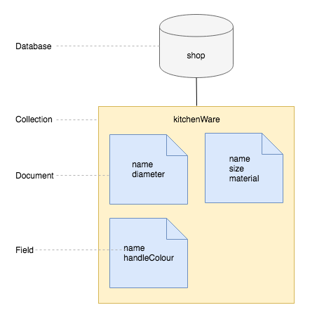
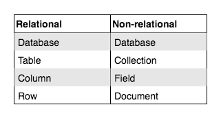
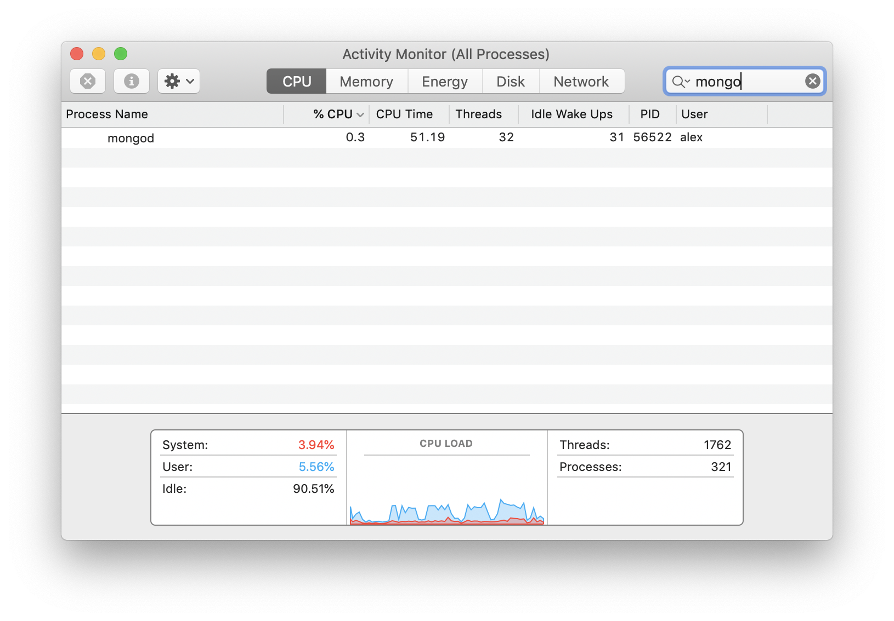
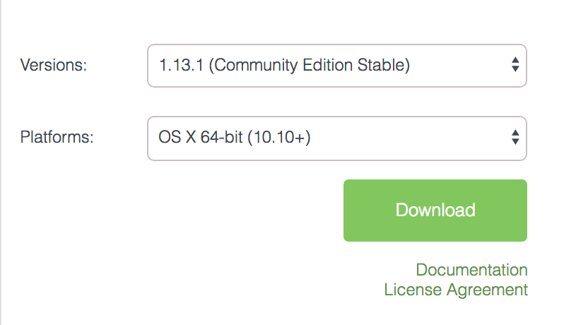

# Intro To MongoDB

**Lesson Duration: 45 minutes**

## Learning Objectives
- Understand what a non-relational database is
- Be able to create a MongoDB database
- Understand what background processes are
- Be able to perform CRUD operations on a MongoDB database
- Know what MongoDB's `ObjectId` is used for

## Introduction

## Relational Verses Non-relational

Databases allow us to organise and store collections of data. Relational databases (such as MySQL and PostgreSQL), have a schema that define tables with columns and rows. Relationships between the tables are created with the use of primary and foreign keys.

There are cases where our data does not fit well into a relational model, for example, if our collection contains objects with different properties, or the same property has values of different datatypes. In these cases a non-relational database might be more appropriate. Non-relational databases are also referred to as 'NoSQL' due to the fact they do not require SQL for queries.

We are going to be using an open-source, non-relational database called MongoDB. MongoDB takes its name from the word 'humongous' and it was designed for storing huge amounts of non-relational data. We will be using JavaScript to query it and as it stores data in collections of JSON-style, key-value pair documents, it is ideal for storing JavaScript objects.

## Non-relational Data

Let's take a look at an example of non-relational data. If a shop stocks products, even within the specific category 'kitchenware', each product might have an entirely different set of properties.

```js
const kitchenware = [
  {
    name: 'frying pan',
    diameter:	28
  },
  {
    name: 'chopping board',
    size:
      {
        width: 20,
        length: 18
      },
    material: 'wood'
  },
  {
    name: 'whisk',
    handleColour: 'red'
  }
]
```

There is no obvious way of organising this data into separate tables, so if we were to try and store this data in a relational database, we would need a column for each property (name, diameter, size, material, handle colour). As each product would only have values for some of the columns, there would be a lot of nulls in the database.

## MongoDB

MongoDB is a document-oriented database. Instead of having tables with columns and rows, it stores data in collections of JSON documents.



*Diagram of non-relational database*

We can see from this diagram that with a non-relational database, we don't have the problem of every kitchenware product having a `handleColour` property, as each object is stored as a document and there are no tables or columns. Instead it has collections of documents and each document has the properties that it requires.



*Terminology to describe the component parts of relational and non-relational databases*

## Background Processes

In order to connect to and carry out CRUD operations on databases we need to have a server running on our Macs. Luckily the laptop script we ran before the start of the course set this up for us. It runs all the time in the background listening for connections. Much like a web server listens for HTTP requests.

Background processes do not have an icon that appears in our dock and we cannot switch to them like a regular application. To see them we can look in Activity Monitor.

1. Use Spotlight (command-space) to search for Activity Monitor
2. In the View menu make sure All Processes is ticked
3. Use the Search bar to look for `mongod`

We can also examine the resources a process is using with the tabs (CPU, Memory...)



If for some reason the `mongod` process froze we could force it to terminate here.

Sometimes we might need to look the logs this MongoDB server produces in order to debug errors. The following command, run in the Terminal will do this for us:

```sh
tail -f /usr/local/var/log/mongodb/mongo.log

# ...
# - > 2019-10-30T15:36:22.232+0000 I  NETWORK  [initandlisten] waiting for connections on port 27017
# ...
```
It shows us the end of the log (`tail`) and updates as new entries are added (`-f`).

## MongoDB from the Command-line

We will be using JavaScript to talk to MongoDB, so there is no need to learn additional querying languages. We are going to create a database with the following structure:

- Database name: 'shop'
- Collection name: 'kitchenware'
- Document: A product with the following properties:
  - name: knife
  - lengths: [15, 20, 25]

Often we will be interacting with MongoDB from our JavaScript applications, but we can also interact with it from the command line. In this lesson we will start by looking at the create and read operations from the command-line, before looking at MongoDB's GUI and running the commands from a file.

### Create and Connect to a Database

Start by opening a new terminal window (the mongod server should still be running in a separate window) and enter the MongoDB shell.

```sh
mongosh
```

We will use the MongoDB shell command `use`, followed by the name of the database, to connect to the database if it exists. If it doesn't, this command will create the database with the specified name and connect to it.

```sh
use shop
```

We are now connected to the database, 'shop'. We have access to a `db` object, which has all the methods that we need to create collections and to create, read, update and delete documents.

We are going to see how to perform the CRUD operations on our MongoDB 'shop' database.

### Creating a Collection and Inserting a Document

We currently don't have any collections in the shop database. We can create a collection and insert a document into it with one command.

We will create a kitchenware collection and insert a document that represents a product (a knife) into it. We use the database object, `db`, access the collection name, `kitchenware`, and call `insertOne`, passing it the JSON object we want to insert. The  [`insertOne`](https://docs.mongodb.com/manual/reference/method/db.collection.insertOne/#db.collection.insertOne) method allows us to insert one document into a collection. If the collection doesn't exist yet, the `insertOne` method will first create it, then insert the document into it.

```sh
db.kitchenware.insertOne({ name: "knife", lengths: [15, 20, 25] });
```
> Note: Because we are inserting a JSON document, we are able to insert an object with nested collections.

You'll notice the following output:

```js

{
	"acknowledged" : true,
	"insertedId" : ObjectId("5bab51cc6467abe6638d6ea5")
}
```

This is telling us that MongoDB has successfully inserted the document into the collection, and that it has given the document an id of '5bab51cc6467abe6638d6ea5'. This is the document's unique identifier.

Let's insert another.

```sh
db.kitchenware.insertOne({ name: "pan", type: 'frying' });
```

### Reading from the Database

Let's now retrieve all the documents in the kitchenware collection using the `find` method. Again, we use the database object, `db`, access the collection, `kitchenware`, and call the method on the collection.

```sh
db.kitchenware.find();
# -> { "_id" : ObjectId("5bab51cc6467abe6638d6ea5"), "name" : "knife", "lengths" : [ 15, 20, 25 ] }
# -> { "_id" : ObjectId("5bab51d36467abe6638d6ea6"), "name" : "pan", "type" : "frying" }
```

When we call `find` on the collection, passing it no arguments, it gives us back all the documents in the collection.

## MongoDB Compass GUI

We can use MongoDB's GUI to more easily view the state of our database. You can download the free community edition from [https://www.mongodb.com/download-center/compass](https://www.mongodb.com/download-center/compass)



*Download settings for MongoDB Compass*

Once you have downloaded MongoDB Compass, open it and click "Connect". Down the left-hand side you will see the list of databases. If you click on a database you will see any collections inside it, and inside the collection, any documents and their fields.

## MongoDB From a File

### Seeding a MongoDB

We can also define our database and seed it with data in a JavaScript file and run it using the MongoDB shell. Let's do that now.

```sh
touch seeds.js
```

We will start by using MongoDB's shell commands to create and switch to a database called 'zoo'.

```js
// seeds.js

use zoo;
```

And as this is a seeds file, we will drop the database so it is cleared each time. Just like when we were working from the command-line, now we are connected to the zoo database, we have the `db` object available to us.

```js
use zoo;
db.dropDatabase(); // NEW
```

### CREATE - `insertOne`

Previously we used `insertOne` to add an entry to our 'kitchenware' collection in our 'shop' database. MongoDB also has an `insertMany` method that we call on our collection. We can pass `insertMany` an array of objects and it will insert all the objects into the database. Like `insertOne`, if there is no animals collection, `insertMany` will create the collection and insert into it.

```js
use zoo;
db.dropDatabase();

db.animals.insertMany([ // NEW
  {
    name: "Janet",
    type: "Polar Bear"
  },
  {
    name: "Norman",
    type: "Penguin",
    age: 5
  }
]);
```

> Note: Because MongoDB is a non-relational database, we can insert entries with different fields without any problems.

To run the file we use the following command:

```sh
mongosh < seeds.js
```

If you refresh MongoDB Compass's database list (using the button at the top of the list of databases), you will see a database called zoo with two animals inside. We have now seeded our database.

### Querying a MongoDB

Next we are going to see how we can query our database. We are going to create a file to use to practice doing this.

```sh
touch mongodb_play.js
```

Again, we need to specify which database we want to use.

```js
// mongodb_play.js

use zoo;
```

### READ

We have seen that we can use `find`, passing it no arguments, to get back all the entries in the collection. If we only want to get one entry back, we can use `findOne`. A common use case for this is when we are querying by a unique identifier, such as an ID.

To be able to find by id, we first need to learn about MongoDb's `ObjectID`.

#### MongoDB `ObjectId`

When we insert an entry into a database, MongoDB assigns it an unique identifier, an [ObjectId](https://docs.mongodb.com/manual/reference/method/ObjectId/), with the key `_id`. You can see these by looking at the entries with MongoDB Compass.

To query the database by ID, we need to create an instance of MongoDB's ObjectId by using the constructor and passing it an existing ID as a string.

```js
// ...

const id = ObjectId('5af17fe430e043c3e62149b8');
```

> Note: Replace the above string ID with an ID of an entry currently in your database. You can access an existing ID from MongoDB Compass.

We pass `findOne` an object with the key `_id`, with a value of our instance of the `ObjectId`. This will return the first entry it finds with the specified `ObjectId`. Because we know the IDs are unique, we know the first will be the only one that will match.

```js
const id = ObjectId('5af17fe430e043c3e62149b8');
db.animals.findOne({ _id: id }); // NEW
```

Run the file to see the found entry in the terminal window.

```sh
mongosh < mongodb_play.js
```

### UPDATE

We can update the fields of existing entries using the `updateMany` method if we want to update multiple entries. When we want to update one entry, we can use the `updateOne` method. We are going to update an entry with a specific ID, so we will use the `updateOne` method, calling it on the collection.

```js
// ...

db.animals.updateOne();
```


We pass `updateOne` two arguments:
1. The query object for specifying which entry we want to update. Again, we will use the ID of the existing entry we want to update, which you can access from MongoDB Compass.
2. An object with the key `$set`. The value should be an object containing the field names and the new values. We will update the name of the animal to be 'Pip'.

```js
// ...

db.animals.updateOne( // MODIFIED
  { _id: ObjectId('5af17fe430e043c3e62149b8') },
  { $set: { name: "Pip" } }
);
```

> Note: Replace the above string ID with an ID of an entry currently in your database.

The first argument is used to identify the entry to update, the second argument is telling MongoDB to 'set' any fields in the existing entry that match a property in the object we pass it, to have the new value. I.e, for the specified entry, if the entry has a 'name' field, update its value to be 'Pip'. (If the entry doesn't have a field name, it will create one.)

When we run the file again, refresh MongoDB Compass's entries list (using the button on the right side, just above the list of entries) we see that the name has been updated.

### DELETE

Lastly, if we want to delete entries from the database we can use the `deleteMany` method and pass it a query object. In the case we want to delete one entry we can use the `deleteOne` method that also takes a query object. Again, we call it on the collection, and it will delete the first document that matches the query (in our case, the first document with a `_id` field with the value of '5af17fe430e043c3e62149b8').

```js
// ...

db.animals.deleteOne({ _id: ObjectId('5af17fe430e043c3e62149b8') });
```

> Note: Replace the above string ID with an ID of an entry currently in your database.

Now if you run the file again, refresh MongoDB Compass's entries list (using the button on the right side, just above the list of entries) you will see that the entry you specified has been removed.

## Recap

What makes a database non-relational?
<details>
<summary>Answer</summary>
- It doesn't have tables with columns that have relationships. Instead it stores documents in collections.
- It doesn't require SQL to query it.
</details>
</br>

What command did we use to create and connect to a MongoDB database?
<details>
<summary>Answer</summary>
`use`
</details>
</br>

Once connected to a MongoDB database, how do we reference it when we want to interact with it?
<details>
<summary>Answer</summary>
`db`
</details>
</br>


What type of object does MongoDB use for entry IDs? And what key does it use to store them?
<details>
<summary>Answer</summary>
`ObjectId`s are created by MongoDB for each entry and stored on the key `_id`.
</details>

## Conclusion

Databases allow us to organise collections of data and access data efficiently. Non-relational data is data that doesn't fit easily into a relational schema (tables with columns and rows). If your data model is non-relational, you may decide to use a non-relational database, such as MongoDB, which stores data as JSON documents in collections.

MongoDB gives each entry an `ObjectId` as a unique identifier. This is stored on the key `_id`. We can create instances of `ObjectId`s to query our database, accessing entries by their ID.

## Further Resources

[A full list of MongoDB collection methods](https://docs.mongodb.com/manual/reference/method/js-collection/)
